<!--
  Part 2: Core principles and CMAF mapping.
  Drafted from:
  - dashif-iop-v5-part2-draft#10..#129 (Part 2 working draft)
  - dashif-iop-v4-3#30..#42 (timing/adaptation-set basics)
  - dashif-iop-v4-3#74..#90 (on-demand/live-profile and multi-period basics)
  - dashif-iop-v4-3#192..#206, #242..#247 (period/adaptation-set carry-over)
  - iso-iec-23009-1-2026-merged-r5 and iso-iec-23000-19-2024 as normative baselines
  This is intentionally a consolidated working draft with Issues marking topics
  that still need editorial or technical closure.
-->

# Scope # {#scope}

This document specifies the core principles for DASH-IF IOP v5 and the mapping of
CMAF content structures to DASH Media Presentations. It defines the shared DASH
and CMAF concepts used by the other parts, including the Media Presentation,
DASH timing model, Segment information, CMAF-to-DASH mappings, multi-Period CMAF
content, bandwidth signalling, static and dynamic services, MPD updates, MPD and
Segment locations, and gap handling.

This part is normative for the common structures used by the other IOP v5 parts.
Media-specific constraints are defined in Parts 7, 8, and 9; live and low-latency
service constraints are defined in Part 4; on-demand-service constraints are
defined in Part 3; content protection constraints are defined in Part 6; ad
insertion and content replacement constraints are defined in Part 5.

Issue: This Part 2 draft is a consolidated migration from the Part 2 working
draft and v4.3. Several tables and precise formulae from the working draft remain
to be reconstructed and reviewed against the current edition of ISO/IEC 23009-1
and ISO/IEC 23000-19. See [[#open-issues]].

# References # {#doc-references}

The following referenced documents are necessary for the application of this
part:

- ISO/IEC 23009-1, *Dynamic adaptive streaming over HTTP (DASH) — Part 1: Media
    presentation description and segment formats* [[!MPEGDASH]].
- ISO/IEC 23000-19, *Common media application format (CMAF) for segmented media*
    [[!MPEGCMAF]].
- ISO/IEC 14496-12, *ISO base media file format* [[!ISOBMFF]].
- DASH-IF IOP v5 Part 1, *Overview, Architecture and Interfaces*.
- DASH-IF IOP v5 Part 12, *Conformance and Reference Tools*.

# Terms, Definitions, Symbols and Abbreviations # {#terms}

## Terms and Definitions ## {#terms-definitions}

For the purposes of this document, the terms and definitions in ISO/IEC 23009-1
[[!MPEGDASH]], ISO/IEC 23000-19 [[!MPEGCMAF]], and the following apply.

: <dfn export>DASH-IF Media Presentation</dfn>
:: A DASH Media Presentation that conforms to the requirements and
    recommendations of the applicable DASH-IF IOP v5 parts.
: <dfn export>CMAF Presentation</dfn>
:: A presentation as defined by CMAF, consisting of CMAF Selection Sets and CMAF
    Tracks intended for synchronized playback.
: <dfn export>CMAF Selection Set</dfn>
:: A CMAF grouping of alternative CMAF Switching Sets from which one Switching
    Set can be selected for a media component.
: <dfn export>CMAF Switching Set</dfn>
:: A CMAF set of CMAF Tracks that are alternatives for switching during playback.
: <dfn export>CMAF Track</dfn>
:: A CMAF media track carried in a CMAF Track File or as a sequence of CMAF
    Segments.
: <dfn export>CMAF Header</dfn>
:: CMAF initialization information for a CMAF Track, analogous in DASH to an
    Initialization Segment.
: <dfn export>CMAF Segment</dfn>
:: A CMAF addressable media object, analogous in DASH to a Media Segment.
: <dfn export>CMAF Chunk</dfn>
:: A CMAF sub-segment object that may be made available progressively; relevant
    for low-latency services in Part 4.
: <dfn export>Good Multi-Period CMAF Content</dfn>
:: Multi-Period DASH content whose Period boundaries and CMAF Track structure
    permit continuous playback, switching, and decoder operation across Periods
    under the requirements of this part.

## Terminology Choices in This Document ## {#terminology-choices}

This document is intended to be a set of guidelines easily understood by solution
designers and developers. In the interest of ease of understanding, some important
adjustments in terminology are made compared to the underlying standards.

[[!MPEGDASH]] has the concept of "segment" (URL-addressable media object) and
"subsegment" (byte range of URL-addressable media object), whereas [[!MPEGCMAF]]
does not make such a distinction. This document uses [[!MPEGCMAF]] terminology,
with the term "segment" in this document being equivalent to "CMAF segment". The
term "segment" in this document may be equivalent to either "segment" or
"subsegment" in [[!MPEGDASH]], depending on the addressing mode used.

This document's concept of the MPD timeline is not directly expressed
in [[!MPEGDASH]]. To improve understandability of the timing model, this document
splits the DASH concept of "presentation timeline" ([[!MPEGDASH]] clause 7.2.1)
into two separate concepts: the aggregated component (MPD timeline) and the
Representation-specific component (sample timeline). These concepts are distinct
but mutually connected via metadata in the MPD.

## Terminology Cross-Reference ## {#terminology-cross-reference}

Different documents often use different terms to refer to the same structural
components of DASH Media Presentations. The following table provides a
cross-reference of terms commonly found causing confusion:

<table class="data">
  <caption>Cross-reference of closely related terms in different standards.</caption>
  <thead>
    <tr>
      <th>ISO/IEC 23009-1 (DASH)
      <th>ISO/IEC 23000-19 (CMAF)
      <th>ISO/IEC 14496-12 (ISOBMFF)
  <tbody>
    <tr>
      <td>(media) segment, subsegment
      <td>CMAF segment, CMAF fragment
      <td>
    <tr>
      <td>initialization segment
      <td>CMAF header
      <td>
    <tr>
      <td>index segment, segment index
      <td>
      <td>segment index box (`sidx`)
</table>

Note: ISO/IEC 23009-1 [[!MPEGDASH]] has the concept of "segment" (URL-addressable
media object) and "subsegment" (byte range of URL-addressable media object),
whereas ISO/IEC 23000-19 [[!MPEGCMAF]] does not make such a distinction. This
document uses CMAF terminology, with the term "segment" in this document being
equivalent to "CMAF segment". The term "segment" in this document may be
equivalent to either "segment" or "subsegment" in ISO/IEC 23009-1, depending on
the addressing mode used.

## Symbols and Abbreviations ## {#symbols-abbreviations}

<table class="data">
  <caption>Common symbols and abbreviations used in Part 2.</caption>
  <thead><tr><th>Term<th>Meaning
  <tbody>
    <tr><td>AST<td><code><b>MPD</b>@availabilityStartTime</code>
    <tr><td>EPT<td>Earliest presentation time of a Segment
    <tr><td>MPD<td>Media Presentation Description
    <tr><td>PS<td>Period start time on the MPD timeline
    <tr><td>PT<td>Presentation time
    <tr><td>PTO<td>`@presentationTimeOffset`
    <tr><td>SAST<td>Segment Availability Start Time
    <tr><td>SAET<td>Segment Availability End Time
    <tr><td>TSB<td>Time Shift Buffer
</table>

# Overview # {#overview}

Part 2 provides the common model used by the rest of the IOP v5 document set:

- a mapping between CMAF structures and DASH MPD structures;
- the timing model that relates Period time, media presentation time, decode
    time, and wall-clock availability time;
- Segment addressing and segment-list derivation using **SegmentTemplate**,
    `$Number$`, `$Time$`, `@duration`, and **SegmentTimeline**;
- common service types (`static`, `dynamic`, MPD updates, locations); and
- interoperability requirements for multi-Period CMAF content and gap handling.

# Introduction to CMAF and DASH Mapping Principles # {#cmaf-dash-principles}

## CMAF Structural Data Model ## {#cmaf-structural-model}

CMAF defines a content model consisting of CMAF Presentations, CMAF Selection
Sets, CMAF Switching Sets, CMAF Tracks, CMAF Headers, CMAF Segments, CMAF
Fragments, and CMAF Chunks [[!MPEGCMAF]]. The relevant addressable CMAF objects
for DASH delivery are:

- **CMAF Headers**, which map to DASH Initialization Segments;
- **CMAF Segments**, which map to DASH Media Segments;
- **CMAF Chunks**, which map to addressable or progressively delivered subparts
    of Segments for low-latency operation; and
- **CMAF Track Files**, which in practical DASH usage are analogous to
    self-initializing Media Segments or single-file Representations.

A DASH-IF Media Presentation shall use CMAF-compliant media tracks when the part
or profile requires CMAF content. A DASH client consumes CMAF media through the
DASH MPD, not directly through the CMAF content model; therefore the CMAF model
is mapped into Periods, Adaptation Sets, Representations, Initialization
Segments, Media Segments, and Subsegments.

## CMAF to DASH Mapping Considerations ## {#mapping-considerations}

A CMAF Presentation is represented as a DASH Media Presentation. A CMAF Selection
Set is typically represented by one or more DASH Adaptation Sets for a media
component. A CMAF Switching Set is typically represented by one DASH Adaptation
Set containing Representations that are switchable under ISO/IEC 23009-1 and the
media-specific IOP part. A CMAF Track maps to a DASH Representation.

The mapping shall preserve:

- synchronization between media components;
- random access and switching points required by the relevant media profiles;
- decoder-configuration compatibility within switching sets;
- Segment timing and addressing information sufficient for the client to derive
    the list of available Segments; and
- metadata and content-protection signalling required by the applicable parts.

# DASH Media Presentation — Core Functionalities # {#dash-core}

## DASH-IF Media Presentation ## {#dashif-media-presentation}

A DASH-IF Media Presentation shall conform to ISO/IEC 23009-1 [[!MPEGDASH]] and
the applicable DASH-IF IOP v5 parts. Unless otherwise specified, DASH-IF IOP v5
uses CMAF media as the segment format baseline. The MPD shall provide sufficient
information for a DASH client to select Adaptation Sets, choose Representations,
derive Segment URLs, map Segment media times to presentation times, and schedule
Segment requests.

## Media Presentation Description ## {#mpd}

The MPD is the entry point for a DASH-IF Media Presentation. It describes the
Media Presentation timeline, Periods, Adaptation Sets, Representations, Segment
information, BaseURL/Location information, and supplemental descriptors. The MPD
shall be authored so that each referenced Segment can be resolved using the
reference-resolution rules of ISO/IEC 23009-1.

## DASH Timing Model ## {#timing-model}

### General ### {#timing-model-general}

The DASH timing model relates four domains:

1. **MPD timeline**: Period start times and Period durations.
2. **Media presentation time**: sample presentation times inside the media.
3. **Segment addressing time**: `$Time$`, `$Number$`, and SegmentTimeline values.
4. **Wall-clock availability time**: used for dynamic services and Segment
    availability.

For each Representation in a Period, the mapping between Segment media time and
presentation time is determined by the Period start time and any
`@presentationTimeOffset`. The client shall use the MPD timing information and
media timing information to present samples at the intended Media Presentation
time.

For dynamic services, availability is additionally constrained by
<code><b>MPD</b>@availabilityStartTime</code>, `@availabilityTimeOffset`, Segment duration, and the
rules for Segment Availability Start Time and Segment Availability End Time in
ISO/IEC 23009-1 and Part 4.

Note: For a comprehensive discussion of the DASH timing model, including detailed
explanations of timing concepts and interoperability constraints, refer to the
DASH-IF Guidelines-TimingModel document [[DASHIF-TIMING]].

### MPD Timeline ### {#mpd-timeline}

The MPD defines the <dfn export>MPD timeline</dfn> of a DASH Media Presentation, which
serves as the baseline for all scheduling decisions made during playback and
establishes the relative timing of Periods and Media Segments. The MPD timeline
informs DASH clients when they can download and present which Media Segments.

Values on the MPD timeline are all ultimately relative to the zero point of the
MPD timeline, though possibly through several layers of indirection (e.g., Period
A is relative to Period B, which is relative to the zero point).

The following MPD elements are most relevant to locating and scheduling media
samples:

1. The MPD describes consecutive Periods which map data onto the MPD timeline.
2. Each Period describes one or more Representations, each of which provides media
   samples inside a sequence of Media Segments. Representations contain
   independent sample timelines that are mapped to the time span on the MPD
   timeline that belongs to the Period.
3. Representations within a Period are grouped into Adaptation Sets, which
   associate related Representations and decorate them with metadata.

<figure>
  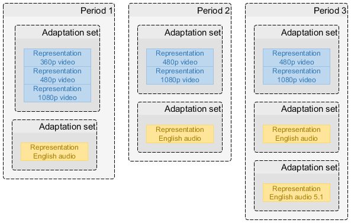
  <figcaption>The primary contents of a Media Presentation, described by an MPD.</figcaption>
</figure>

### Period Timing ### {#period-timing}

#### General #### {#period-timing-general}

An MPD defines an ordered list of one or more consecutive non-overlapping Periods
[[!MPEGDASH]]. A Period is both a time span on the MPD timeline and a definition
of the data to be presented during this time span. Period timing is relative to
the zero point of the MPD timeline, though often indirectly (being relative to the
previous Period).

<figure>
  
  <figcaption>An MPD defines a collection of consecutive non-overlapping Periods.</figcaption>
</figure>

The start of a Period is specified either explicitly as an offset from the MPD
timeline zero point (<code><b>Period</b>@start</code>) or implicitly by the end of the previous
Period [[!MPEGDASH]]. The duration of a Period is specified either explicitly with
<code><b>Period</b>@duration</code> or implicitly by the start point of the next Period
[[!MPEGDASH]].

Periods are self-contained: a service shall not require a client to know the
contents of another Period in order to correctly present a Period. Knowledge of
the contents of different Periods may be used by a client to achieve seamless
Period transitions, especially when working with period-connected Representations
(see Part 5 for multi-Period content requirements).

Common reasons for defining multiple Periods are:

- Assembling a presentation from multiple self-contained pieces of content.
- Inserting ads in the middle of existing content and/or replacing spans of
  existing content with ads (see Part 5).
- Adding/removing certain Representations as the nature of the content changes
  (e.g., a new title starts with a different set of offered languages).
- Updating period-scoped metadata (e.g., codec configuration or DRM signaling).

A Period shall not have a duration of zero. MPD generators are expected to remove
any Periods that are, for any reason, assigned a duration of zero. Clients shall
ignore Periods with a duration of zero.

#### First and Last Period Timing #### {#first-last-period-timing}

For static presentations (`MPD@type="static"`), the first Period shall start at the
zero point of the MPD timeline (with a <code><b>Period</b>@start</code> value of 0 seconds), and the
last Period shall have a <code><b>Period</b>@duration</code>. See Part 3 for additional on-demand
service constraints.

For dynamic presentations (`MPD@type="dynamic"`), the first Period shall start at or
after the zero point of the MPD timeline (with a <code><b>Period</b>@start</code> value of 0 seconds
or greater). The last Period may have a <code><b>Period</b>@duration</code>, in which case it has a
fixed duration. If without <code><b>Period</b>@duration</code>, the last Period in a dynamic
presentation has an unlimited duration that may later be shortened by an MPD
update. See Part 4 for additional live and low-latency service constraints.

<code><b>MPD</b>@mediaPresentationDuration</code> may be present in an MPD. If present, it shall
accurately match the duration between the zero point on the MPD timeline and the
end of the last Period. Clients shall calculate the total duration of a static
presentation by adding up the durations of each Period and shall not rely on the
presence of <code><b>MPD</b>@mediaPresentationDuration</code>.

Issue: Carry over additional v4.3 timing-model formulae where they add
interoperability value beyond ISO/IEC 23009-1. Avoid duplicating formulae that are
now fully specified in the current MPEG-DASH edition.

### Representation Timing ### {#representation-timing}

#### General #### {#representation-timing-general}

Representations provide the content for periods. A representation is a sequence of media segments, an initialization segment, an optional index segment and related metadata (see ISO/IEC 23009-1 [[!MPEGDASH]] clauses 5.3.1 and 5.3.5).

The MPD describes each representation using a **Representation** element. For each representation, the MPD defines a set of <dfn>segment references</dfn> to the media segments and metadata describing the media samples provided by the representation.

#### Sample Timeline #### {#timing-sampletimeline}

The samples within a representation exist on a linear <dfn>sample timeline</dfn> defined by the encoder that creates the samples. Sample timelines are mapped onto the MPD timeline by metadata stored in or referenced by the MPD (see ISO/IEC 23009-1 [[!MPEGDASH]] clause 7.3.2).

<figure>
	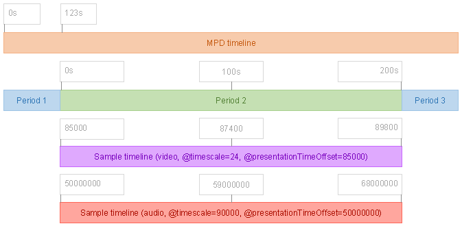
	<figcaption>A sample timeline is mapped onto the MPD timeline based on parameters defined in the MPD, relating the media samples provided by a representation to the portion of the MPD timeline covered by the period that references the representation.</figcaption>
</figure>

The sample timeline does not determine what samples are presented. It merely connects the timing of the representation to the MPD timeline and allows the correct media segments to be identified when a DASH client makes scheduling decisions driven by the MPD timeline.

The same sample timeline shall be shared by all representations in the same adaptation set [[!MPEGCMAF]]. Representations in different adaptation sets may use different sample timelines.

A sample timeline is measured in <dfn>timescale units</dfn> defined as a number of units per second. This value (the <dfn>timescale</dfn>) shall be present in the MPD as <code><b>SegmentTemplate</b>@timescale</code> or <code><b>SegmentBase</b>@timescale</code> (depending on the addressing mode).

<figure>
	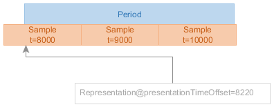
	<figcaption>`@presentationTimeOffset` is the key component in establishing the relationship between the MPD timeline and a sample timeline.</figcaption>
</figure>

The zero point of a sample timeline may be at the start of the period or at any earlier point. The point on the sample timeline indicated by `@presentationTimeOffset` is equivalent to the period start point on the MPD timeline (see ISO/IEC 23009-1 [[!MPEGDASH]] clause 5.3.9.2).

Note: To transform a sample timeline position `SampleTime` to an MPD timeline position, use the formula `MpdTime = Period@start + (SampleTime - @presentationTimeOffset) / @timescale`.

See the DASH-IF Guidelines-TimingModel document [[DASHIF-TIMING]] for detailed discussion of sample timeline mechanics.

### Referencing Media Segments ### {#timing-segment-references}

#### General #### {#timing-segment-references-general}

Each segment reference addresses a media segment that corresponds to a specific time span on the sample timeline. The exact mechanism used to define segment references depends on the addressing mode used by the representation.

#### Necessary Segment References in Static Presentations #### {#necessary-references-static}

In a static presentation, a representation shall provide enough media segments to cover the entire time span of the period.

<figure>
	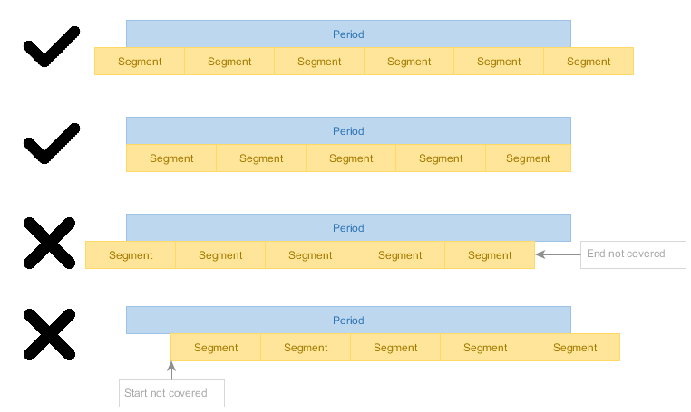
	<figcaption>In a static presentation, the entire period must be covered with media segments.</figcaption>
</figure>

#### Necessary Segment References in Dynamic Presentations #### {#necessary-references-dynamic}

In a dynamic presentation, a representation shall provide enough media segments to cover the time span of the period that intersects with the time shift buffer at any point during the MPD validity duration.

<figure>
	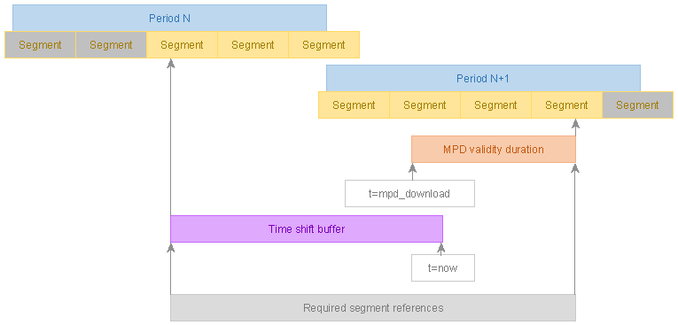
	<figcaption>In a dynamic presentation, the time shift buffer and MPD validity duration determine the set of required segment references for each representation.</figcaption>
</figure>

Note: It is a valid and common situation that a media segment is required to be referenced but is not yet available. See ISO/IEC 23009-1 [[!MPEGDASH]] for segment availability timing rules.

See the DASH-IF Guidelines-TimingModel document [[DASHIF-TIMING]] for detailed discussion of segment reference requirements.

### Clock Drift ### {#no-clock-drift}

#### General #### {#clock-drift-general}

Some encoders experience clock drift - they do not produce exactly 1 second worth of output per 1 second of input, either stretching or compressing the sample timeline with respect to the MPD timeline.

<figure>
	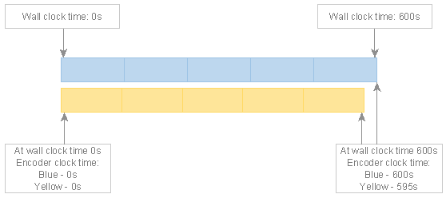
	<figcaption>Comparison of an encoder correctly tracking wall clock time (blue) and an encoder with a clock that runs too slowly (yellow), leading it to produce fewer seconds of content than expected.</figcaption>
</figure>

Clock drift not only causes timing model violations when an insufficient amount of data is produced but also leads to de-synchronization of content in tracks encoded based on different clocks. CMAF [[!MPEGCMAF]] clauses 6.3 and 6.6.8 require tracks to be synchronized.

A DASH service shall not publish content that suffers from clock drift.

The solution is to adjust the encoder so that it correctly tracks wall clock time, e.g. by performing regular small adjustments to the encoder clock to counteract any "natural" drift it may be experiencing.

#### Workarounds for Clock Drift #### {#clock-drift-workarounds}

If the encoder cannot be adjusted to not suffer from clock drift, DASH packagers should implement workarounds to ensure the presentation conforms to targeted standards. The following are examples of approaches a DASH packager could use:

1. Drop a span of content if input is produced faster than real-time.
2. Insert regular padding content if input is produced slower than real-time (silence, blank picture, repeating frames, or short-duration periods where affected representations are not present).

Such workarounds can be disruptive and only serve as a backstop to prevent complete playback failure caused by timing model violations.

See the DASH-IF Guidelines-TimingModel document [[DASHIF-TIMING]] for detailed discussion of clock drift issues and solutions.

### Clock Synchronization ### {#clock-sync}

During playback of dynamic presentations, a <dfn>wall clock</dfn> is used as the timing reference for DASH client decisions. This is a synchronized clock shared by the DASH client and service.

It is critical to synchronize the clocks of the DASH client and service when using a dynamic presentation because the MPD timeline of a dynamic presentation is mapped to wall clock time and many playback decisions are clock driven.

Clock synchronization mechanisms are described by **UTCTiming** elements in the MPD (see ISO/IEC 23009-1 [[!MPEGDASH]] clause 5.8.4.11).

The MPD of a dynamic presentation shall include at least one **UTCTiming** element that defines a clock synchronization mechanism.

A client presenting a dynamic presentation shall synchronize its local clock according to the **UTCTiming** elements in the MPD and shall emit a warning or error to application developers when clock synchronization fails.

A DASH client shall not use a synchronization method that is not listed in the MPD unless explicitly instructed to do so by the application developer.

See Part 4 for detailed requirements on clock synchronization in live services. See the DASH-IF Guidelines-TimingModel document [[DASHIF-TIMING]] for comprehensive discussion of clock synchronization.

## DASH Representation Structures and Signalling ## {#representation-structures}

### General ### {#representation-general}

Representations in an Adaptation Set are alternatives for the same media
component unless otherwise signalled. Adaptation Sets and Representations shall
carry sufficient codec, profile, resolution, language, role, accessibility,
content-protection, and essential/supplemental property signalling for a client
to select and play the content.

Adaptation Set constraints from v4.3 remain applicable unless superseded by the
media-specific parts: Representations in an Adaptation Set should be switchable
at defined switching points and should use compatible decoder configurations
where switching is expected.

### Segment Information ### {#segment-information}

#### General #### {#segment-information-general}

DASH-IF IOP v5 uses the Segment information mechanisms of ISO/IEC 23009-1. This
part defines three <dfn>addressing modes</dfn> for referencing Media Segments,
Initialization Segments, and Index Segments in interoperable DASH presentations:

1. **Indexed addressing** (SegmentBase) - Uses an index segment to reference all
   Media Segments via byte ranges in a CMAF track file
2. **Explicit addressing** (SegmentTemplate with SegmentTimeline) - Uses a
   segment timeline to explicitly signal each Media Segment's timing
3. **Simple addressing** (SegmentTemplate with duration) - Uses a nominal
   duration to derive Media Segment timing

All Representations in the same Adaptation Set shall use the same addressing
mode. Representations in different Adaptation Sets may use different addressing
modes.

Addressing mode selection should be based on the nature of the content:

- **Content generated on the fly** (e.g., live encoding): Use explicit addressing
- **Content generated in advance of publishing** (e.g., VOD): Use indexed
  addressing or explicit addressing
- **Simple packager implementations**: May use simple addressing, though this
  comes at a cost of reduced applicability to multi-period scenarios and reduced
  client compatibility

<table class="data">
  <caption>Common SegmentTemplate modes.</caption>
  <thead><tr><th>Mode<th>Addressing<th>Timeline information<th>Typical use
  <tbody>
    <tr><td>Number + Duration<td>`$Number$`<td>`@duration`<td>Regular Segment duration.
    <tr><td>Number + SegmentTimeline<td>`$Number$`<td>**SegmentTimeline**<td>Variable durations or gaps with sequence-number addressing.
    <tr><td>Time + SegmentTimeline<td>`$Time$`<td>**SegmentTimeline**<td>Media-time addressing; accurate timeline signalling.
</table>

A SegmentTemplate-based Representation shall include all attributes and elements
required by ISO/IEC 23009-1 for the selected mode. Attributes and elements not
specified by this part are governed by ISO/IEC 23009-1.

#### Indexed Addressing (SegmentBase) #### {#indexed-addressing}

A Representation that uses indexed addressing consists of a CMAF track file
containing an index segment, an Initialization Segment, and a sequence of Media
Segments.

Note: This addressing mode is sometimes called "SegmentBase" in other documents.

<figure>
  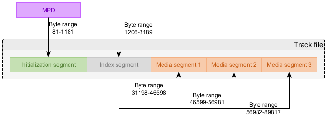
  <figcaption>Indexed addressing is based on an index segment that references all Media Segments.</figcaption>
</figure>

The MPD defines the byte range in the CMAF track file that contains the index
segment. The index segment informs the client of all the Media Segments that
exist, the time spans they cover on the sample timeline, and their byte ranges.

Multiple Representations shall not be stored in the same CMAF track file (i.e.,
no multiplexed Representations are to be used).

At least one `Representation/BaseURL` element shall be present in the MPD,
containing a URL pointing to the CMAF track file.

The <code><b>SegmentBase</b>@indexRange</code> attribute shall be present in the MPD. The value of
this attribute identifies the byte range of the index segment in the CMAF track
file [[!MPEGDASH]]. The value is a `byte-range-spec` as defined in [[!RFC7233 obsolete]],
referencing a single range of bytes.

The <code><b>SegmentBase</b>@timescale</code> attribute shall be present and its value shall match
the value of the `timescale` field in the index segment (in the [[!ISOBMFF]]
`sidx` box) and the value of the `timescale` field in the Initialization Segment
(in the `tkhd` box [[!ISOBMFF]]).

The `SegmentBase/Initialization@range` attribute shall identify the byte range of
the Initialization Segment in the CMAF track file. The value is a
`byte-range-spec` as defined in [[!RFC7233 obsolete]], referencing a single range of
bytes. The <code><b>Initialization</b>@sourceURL</code> attribute shall not be used.

Indexed addressing enables all data associated with a single Representation to be
stored in a single CMAF track file from which byte ranges are served to clients
to supply Media Segments, the Initialization Segment, and the index segment. This
gives it unique advantages:

- A single large file is more efficient to transfer and cache than many small
  files, reducing computational and I/O overhead
- CDNs are aware of the nature of byte-range requests and can preemptively
  read-ahead to fill the cache ahead of playback

#### Explicit Addressing (SegmentTemplate with SegmentTimeline) #### {#explicit-addressing}

A Representation that uses explicit addressing consists of a set of Media
Segments accessed via URLs constructed using a template defined in the MPD, with
the MPD explicitly signaling the start time and duration of each Media Segment.

Note: This addressing mode is sometimes called "SegmentTemplate with
SegmentTimeline" in other documents.

The <code><b>SegmentTemplate</b>@media</code> attribute shall contain the URL template for
referencing Media Segments. The <code><b>SegmentTemplate</b>@initialization</code> attribute shall
contain the URL template for referencing Initialization Segments.

Either the `$Time$` or `$Number$` template variable shall be present in
<code><b>SegmentTemplate</b>@media</code> to uniquely identify Media Segments:

- If using `$Number$` addressing, the number of the first segment reference is
  defined by <code><b>SegmentTemplate</b>@startNumber</code> (default value 1) [[!MPEGDASH]]
- If using `$Time$` addressing, the template value for each segment reference is
  the segment start point on the sample timeline [[!MPEGDASH]]

The **SegmentTimeline** element shall be present and shall contain one or more `S`
elements that define the sequence of Media Segments. Each `S` element defines:

- `@t` - Start time of the first Media Segment in this sequence (in timescale
  units). If omitted, the start time is derived from the previous `S` element
- `@d` - Duration of each Media Segment in this sequence (in timescale units)
- `@r` - Number of times to repeat this Media Segment duration (optional, default
  0)

Explicit addressing is particularly suitable for:

- Content generated on the fly (e.g., live encoding)
- Variable Media Segment durations
- Signaling gaps in the timeline
- Accurate timeline signaling for multi-period content

#### Simple Addressing (SegmentTemplate with duration) #### {#simple-addressing}

A Representation that uses simple addressing consists of a set of Media Segments
accessed via URLs constructed using a template defined in the MPD, with the MPD
describing the nominal time span of the sample timeline covered by each Media
Segment.

Note: This addressing mode is sometimes called "SegmentTemplate without
SegmentTimeline" in other documents.

Advisement: Simple addressing defines the nominal time span of each Media Segment
in the MPD. The true time span covered by samples within the Media Segment can be
slightly different than the nominal time span (up to ±50% of the nominal
duration).

The <code><b>SegmentTemplate</b>@duration</code> attribute defines the nominal duration of a Media
Segment in timescale units [[!MPEGDASH]].

The <code><b>SegmentTemplate</b>@media</code> attribute shall contain the URL template for
referencing Media Segments. The <code><b>SegmentTemplate</b>@initialization</code> attribute shall
contain the URL template for referencing Initialization Segments.

Either the `$Time$` or `$Number$` template variable shall be present in
<code><b>SegmentTemplate</b>@media</code> to uniquely identify Media Segments:

- If using `$Number$` addressing, the number of the first segment reference is
  defined by <code><b>SegmentTemplate</b>@startNumber</code> (default value 1) [[!MPEGDASH]]
- If using `$Time$` addressing, the template value for each segment reference is
  the segment start point on the sample timeline minus `@eptDelta` [[!MPEGDASH]]

The `@eptDelta` attribute may be used to adjust the Period start point relative
to the first Media Segment. The `@eptDelta` attribute shall be present if its
value is not zero.

Note: `@eptDelta` is expressed as an offset from the Period start point to the
segment start point of the first Media Segment [[!MPEGDASH]]. The value will be
negative if the first Media Segment starts before the Period start point.

Simple addressing enables packager logic to be very simple. This simplicity comes
at a cost of reduced applicability to multi-period scenarios and reduced client
compatibility.

### Segment List Computation ### {#segment-list-computation}

A DASH client derives the Segment list for a Representation from the MPD. For
`@duration`-based addressing, the segment sequence is derived from Period timing,
`@duration`, `@timescale`, `@startNumber`, and `@presentationTimeOffset`. For
**SegmentTimeline**-based addressing, the sequence is derived from the ordered `S`
elements and their `@t`, `@d`, and `@r` values.

For `$Time$` addressing, the value substituted into the URL is the media time of
the Segment as signalled by the SegmentTimeline. For `$Number$` addressing, the
value substituted into the URL is the segment number starting at `@startNumber`.

Issue: Reconstruct the full Part 2 draft Table 5 (mandatory/optional/default
SegmentTemplate parameters for the three modes) and the detailed segment-list
computation examples. [GROUNDED_BY=dashif-iop-v5-part2-draft#45..#51]

### Subsegment Information ### {#subsegment-information}

Subsegment information may be used by clients for byte-range access, random
access, trick modes, low-latency operation, and other optimizations. Where CMAF
Chunks are used, the low-latency constraints of Part 4 apply. Subsegment
information shall be consistent with the media data and Segment addressing.

### Segment and Representation to Media Presentation Time Mapping ### {#segment-time-mapping}

For each Segment, the media presentation time is derived from media timestamps,
`@timescale`, `@presentationTimeOffset`, and the Period start. The authoring shall
ensure that the mapping is unambiguous and continuous unless a gap or discontinuity
is intentionally signalled.

# CMAF to DASH Mappings # {#cmaf-to-dash}

## Introduction ## {#cmaf-to-dash-intro}

The CMAF-to-DASH mapping shall preserve CMAF constraints while exposing DASH
client operations through the MPD. In particular:

- a CMAF Header maps to an Initialization Segment;
- a CMAF Segment maps to a DASH Media Segment;
- a CMAF Track maps to a DASH Representation;
- CMAF Switching Sets map to switchable DASH Representation sets; and
- CMAF Selection Sets map to alternative media-component selections.

The MPD shall not signal switching or selection capabilities that are not
supported by the underlying CMAF media.

## Period Connectivity ## {#period-connectivity}

### General ### {#period-connectivity-general}

Period connectivity determines whether playback can continue seamlessly across a
Period boundary or whether a discontinuity occurs. A presentation is
*period-connected* when adjacent Periods allow continuous playback without decoder
reinitialization. A presentation is *period-disconnected* when Period boundaries
require decoder reset or introduce playback discontinuities.

According to [[!MPEGDASH]] clause 5.3.2.1, Periods are period-connected when:

- Adjacent Periods have no gap in their presentation times on the MPD timeline;
- Representations in adjacent Periods belong to the same Adaptation Set or to
  Adaptation Sets with matching `@id` values; and
- The media characteristics (codec, resolution, sample rate, etc.) allow seamless
  continuation without decoder reinitialization.

For period-connected presentations:

- CMAF Switching Sets should maintain continuity across Period boundaries;
- Segment timing shall ensure that the last sample of a Period and the first
  sample of the next Period form a continuous timeline;
- Decoder state may be preserved across the Period boundary; and
- Clients may perform seamless switching at the Period boundary.

<figure>
  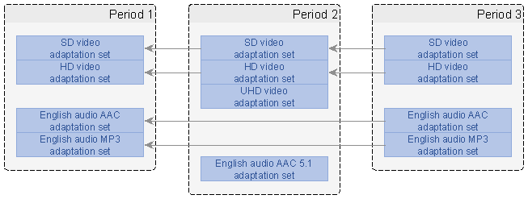
  <figcaption>Period connectivity allows continuous playback across Period
  boundaries when media characteristics and timing are compatible.</figcaption>
</figure>

For period-disconnected presentations, the Period boundary introduces a
discontinuity that may require decoder reset, buffer flushing, or other client
operations. Content authors should signal period-disconnected boundaries clearly
through MPD structure and should ensure that clients can detect and handle such
boundaries appropriately.

### Segment Overlap on Period Connectivity ### {#segment-overlap-period-connectivity}

When Periods are period-connected, Media Segments may span the Period boundary. In
such cases:

- The Segment shall be referenced by both Periods using appropriate
  `@presentationTimeOffset` values;
- The media timeline shall remain continuous across the boundary; and
- Clients shall process the overlapping Segment according to the Period timing
  constraints.

<figure>
  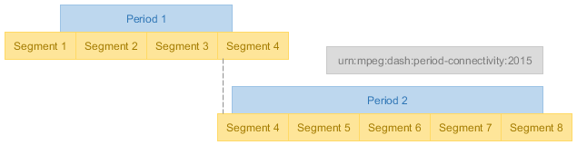
  <figcaption>Segments may span Period boundaries in period-connected
  presentations, requiring careful timing coordination.</figcaption>
</figure>

Segment overlap at Period boundaries is common in live services with dynamic Period
insertion (e.g., ad insertion) and in multi-Period static content. Content authors
shall ensure that overlapping Segments are correctly referenced and that timing
remains unambiguous.

### Period Continuity ### {#period-continuity}

In addition to period connectivity, [[!MPEGDASH]] clause 5.3.2.4 defines
<dfn export>period continuity</dfn>. Continuity is a special case of period connectivity
that indicates no timeline discontinuity is present at the transition point between
the media samples of the two continuous Periods. Under continuity conditions, the
client is expected to be able to continue seamless playback by merely appending
Media Segments from the new Period, without any reconfiguration at the Period
boundary.

Continuity shall not be signalled if the first/last sample in the Media Segment
on the Period boundary does not exactly start/end on the Period boundary. This
cannot be expected to be generally true, as Period boundaries are often an
editorial decision independent of the Media Segment and sample layout.

Period continuity may be signalled in the MPD when the above condition is met,
in which case period connectivity shall not be simultaneously signalled on the
same Representation. Continuity implies connectivity [[!MPEGDASH]].

The signalling of period continuity is the same as for period connectivity, except
that the value to use for `@schemeIdUri` is `urn:mpeg:dash:period-continuity:2015`
[[!MPEGDASH]] clause 5.3.2.4.

Clients may take advantage of any platform-specific optimizations for seamless
playback that knowledge of period continuity enables; beyond that, clients shall
treat continuity the same as connectivity.

## Samples on Period Boundaries ## {#samples-on-period-boundaries}

Sample alignment at Period boundaries affects seamless playback and switching
behavior. For period-connected presentations, samples at the Period boundary shall
maintain presentation time continuity and shall allow decoder state preservation.

Key considerations for samples at Period boundaries:

- **Presentation Time Continuity**: The presentation time of the first sample in
  Period N+1 shall immediately follow the presentation time of the last sample in
  Period N, accounting for sample duration.
- **Decode Time Handling**: Decode timestamps shall maintain proper ordering across
  the boundary, particularly for media with B-frames or other reordering.
- **Random Access Points**: If a Period boundary requires a random access point
  (e.g., for period-disconnected presentations), the first sample in the new Period
  shall be a random access point (IDR frame for video, sync sample for audio).
- **Sample Dependencies**: For period-connected presentations, samples in Period N+1
  may depend on samples in Period N if the decoder state is preserved.

<figure>
  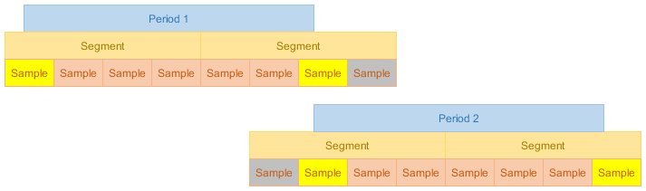
  <figcaption>Sample timing and dependencies at Period boundaries must be
  carefully managed to ensure seamless playback.</figcaption>
</figure>

Content authors shall ensure that:

- Sample timing is unambiguous at Period boundaries;
- Decoder requirements are clearly signalled through MPD and media metadata;
- Period boundaries align with appropriate media structure (e.g., GOP boundaries for
  period-disconnected presentations); and
- Switching Sets maintain consistent sample alignment across Periods.

For period-disconnected presentations, the first sample of each Period shall be a
random access point, and clients shall reinitialize decoders as needed.

## Non-Equal Length Tracks ## {#non-equal-length-tracks}

### General ### {#non-equal-length-tracks-general}

When creating multi-Period presentations, content authors often encounter situations
where different media components (video, audio, subtitles) have different durations.
This creates a challenge: how should the Period structure accommodate tracks of
varying lengths while maintaining proper synchronization and playback continuity?

<figure>
  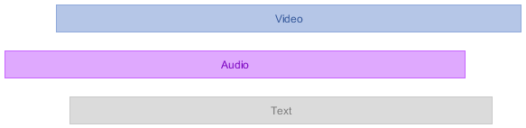
  <figcaption>Initial situation: tracks of different lengths need to be
  organized into Periods.</figcaption>
</figure>

Several strategies exist for handling non-equal length tracks, each with different
trade-offs:

### Padding Strategy ### {#padding-strategy}

The padding strategy extends shorter tracks to match the duration of the longest
track by adding padding content (silence for audio, blank frames for video, empty
subtitles for text).

<figure>
  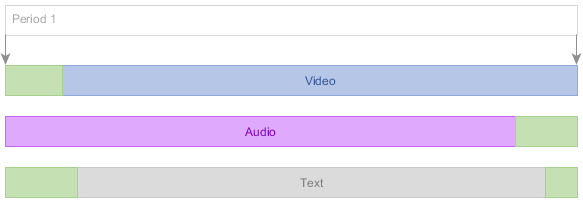
  <figcaption>Padding strategy: extend all tracks to match the longest
  track.</figcaption>
</figure>

**Advantages:**
- Simple Period structure (single Period for entire presentation)
- All tracks remain synchronized throughout
- No Period boundaries to manage

**Disadvantages:**
- Increases bandwidth consumption for padded content
- May require generating artificial padding content
- Padding content must be properly signalled to avoid playback artifacts

When using padding:
- Padding content shall be valid media that decoders can process without errors
- Audio padding should be silence at appropriate sample rate
- Video padding should use minimal bitrate (e.g., static frame)
- Subtitle padding may use empty cues or no active subtitles

### Cutting Strategy ### {#cutting-strategy}

The cutting strategy truncates longer tracks to match the duration of the shortest
track, discarding content that extends beyond the common duration.

<figure>
  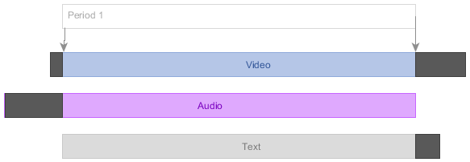
  <figcaption>Cutting strategy: truncate all tracks to match the shortest
  track.</figcaption>
</figure>

**Advantages:**
- Simple Period structure (single Period)
- No artificial content generation required
- Minimal bandwidth usage

**Disadvantages:**
- Loses content from longer tracks
- May not be acceptable if all content must be preserved
- Requires careful selection of cut point (should align with random access points)

When using cutting:
- Cut points shall align with random access points for affected tracks
- The final sample of each track shall have proper duration signalling
- Content authors should ensure the cut point represents a natural end for all tracks

### Period Splitting Strategy ### {#period-splitting-strategy}

The Period splitting strategy creates multiple Periods, with each Period containing
only the tracks that have content for that time span. This preserves all original
content without adding padding.

<figure>
  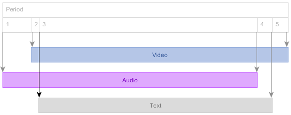
  <figcaption>Period splitting strategy: create multiple Periods to accommodate
  different track lengths.</figcaption>
</figure>

**Advantages:**
- Preserves all original content
- No artificial padding required
- Efficient bandwidth usage
- Natural representation of content structure

**Disadvantages:**
- More complex Period structure
- Requires careful Period boundary management
- May require Period-connected or period-disconnected signalling
- Client must handle Period transitions

When using Period splitting:
- Period boundaries shall align with random access points
- Adaptation Set continuity shall be properly signalled across Periods
- Period timing shall ensure no gaps or overlaps on the MPD timeline
- Content authors should consider whether Periods are period-connected or
  period-disconnected

### Mixed Strategy ### {#mixed-strategy}

The mixed strategy combines elements of padding, cutting, and Period splitting to
optimize for specific use cases. For example, minor duration differences might be
handled with padding while major differences trigger Period splitting.

<figure>
  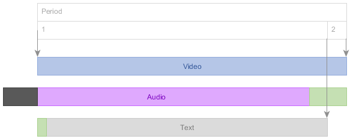
  <figcaption>Mixed strategy: combine padding, cutting, and Period splitting as
  appropriate.</figcaption>
</figure>

**Advantages:**
- Flexible approach tailored to specific content
- Can optimize for bandwidth, complexity, or content preservation
- Allows different strategies for different track types

**Disadvantages:**
- Most complex to implement
- Requires careful decision logic
- May be harder to validate and test

When using mixed strategies:
- Decision criteria shall be clearly defined and consistently applied
- Each strategy component shall follow the requirements for that strategy
- The overall Period structure shall remain coherent and unambiguous

### Strategy Selection Guidance ### {#strategy-selection}

Content authors should select a strategy based on:

- **Content preservation requirements**: If all content must be preserved, avoid
  cutting strategy
- **Bandwidth constraints**: Padding increases bandwidth; Period splitting or cutting
  minimizes it
- **Client compatibility**: Some clients may handle Period transitions better than
  others
- **Duration differences**: Small differences favor padding; large differences favor
  Period splitting
- **Content type**: Audio padding is simpler than video padding; subtitles may
  naturally end early

## Period Splitting ## {#period-splitting}

### General ### {#period-splitting-general}

Period splitting is the process of dividing a single Period into multiple consecutive
Periods. This is commonly needed when:

- Handling non-equal length tracks (as described above)
- Inserting ads or other content into an existing presentation
- Updating metadata or codec parameters mid-presentation
- Accommodating content protection changes
- Managing live service boundaries

### When to Split Periods ### {#when-to-split}

Periods should be split when:

- Different media components have significantly different durations
- Content characteristics change (codec, resolution, DRM, etc.)
- Ad insertion or content replacement is required
- Metadata updates cannot be signalled within a single Period
- Service operations require distinct content segments

Periods should not be split unnecessarily, as each Period boundary introduces
complexity for both content authoring and client playback.

### How to Split Periods ### {#how-to-split}

<figure>
  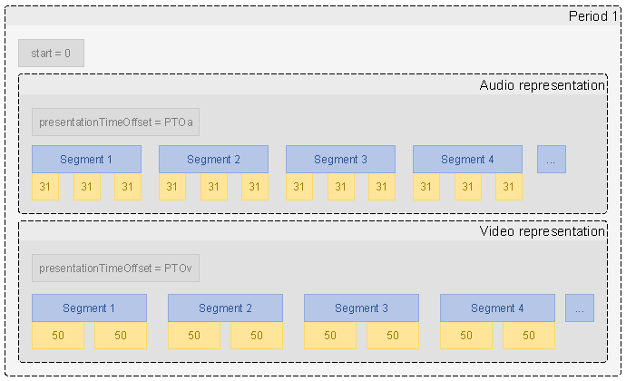
  <figcaption>Before splitting: single Period with all tracks.</figcaption>
</figure>

<figure>
  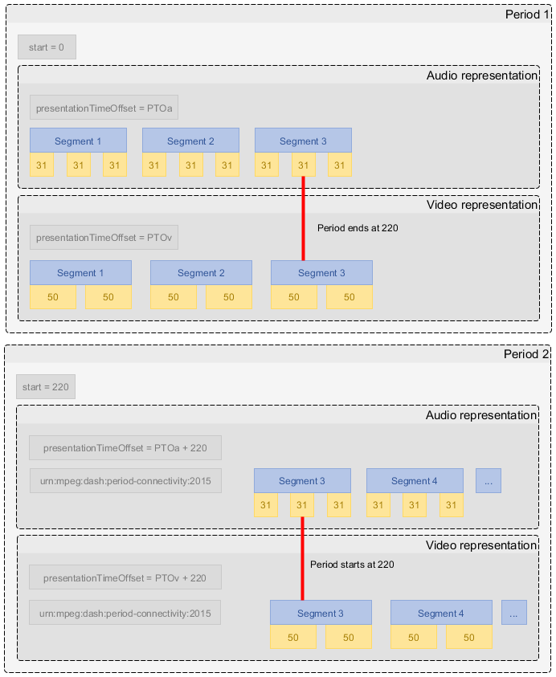
  <figcaption>After splitting: multiple Periods with appropriate track
  distribution.</figcaption>
</figure>

When splitting Periods, content authors shall:

1. **Identify the split point**: Choose a point on the MPD timeline where the split
   should occur. This shall align with random access points in all affected tracks.

2. **Determine Period connectivity**: Decide whether the Periods should be
   period-connected (seamless playback) or period-disconnected (discontinuity
   allowed).

3. **Set Period timing**: Assign <code><b>Period</b>@start</code> and <code><b>Period</b>@duration</code> values such
   that:
   - The first Period ends at the split point
   - The second Period starts at the split point
   - No gap or overlap exists on the MPD timeline

4. **Distribute Representations**: Assign Representations to the appropriate Period
   based on their content availability:
   - Representations that span the split point may appear in both Periods (if
     period-connected)
   - Representations that end before the split point appear only in the first Period
   - Representations that start after the split point appear only in the second
     Period

5. **Maintain Adaptation Set consistency**: If Adaptation Sets span multiple Periods,
   use matching `@id` values to signal continuity.

6. **Update `@presentationTimeOffset`**: Ensure each Representation's
   `@presentationTimeOffset` correctly maps its sample timeline to the Period's
   position on the MPD timeline.

7. **Verify Segment references**: Ensure all Segment references remain valid and
   correctly address the media data.

### Period Splitting and Decoder State ### {#period-splitting-decoder-state}

For period-connected Periods:
- Decoder state may be preserved across the boundary
- Samples in the second Period may depend on samples in the first Period
- The split point should align with GOP boundaries but need not be an IDR frame

For period-disconnected Periods:
- Decoder state shall be reset at the boundary
- The first sample in the second Period shall be a random access point
- No sample dependencies shall cross the Period boundary

### Period Splitting Best Practices ### {#period-splitting-best-practices}

Content authors should:

- Minimize the number of Period splits to reduce complexity
- Align split points with natural content boundaries (scene changes, chapter marks)
- Use period-connected Periods when seamless playback is required
- Use period-disconnected Periods when content characteristics change significantly
- Test Period transitions with representative client implementations
- Document the rationale for Period splits in content metadata

## Good Multi-Period CMAF Content ## {#good-multi-period}

Multi-Period content is common for ad insertion, program boundaries, blackout
replacement, and service operations. For continuous CMAF multi-Period content,
the Period boundary shall not require decoder reset or visible/audible disruption
unless such discontinuity is intentionally signalled and expected by the service.

A service offering continuous multi-Period CMAF content should ensure:

- Period boundaries align with random access points for the affected media;
- decoder configurations are compatible across Periods where continuity is
    expected;
- the same media component semantics are preserved across adjacent Periods; and
- Period start times and Segment timing are consistent with the intended media
    presentation timeline.

Issue: The Part 2 draft contains substantial unfinished text on Good
Multi-Period CMAF Content, including continuous CMAF multi-Period content,
service-offering requirements, client-processing requirements, and profile
signalling. This draft captures the core intent only; the detailed profile text
must be completed with Part 5 ad-insertion alignment. [GROUNDED_BY=dashif-iop-v5-part2-draft#73..#93]

## Multi-Period Content Profile Signalling ## {#multi-period-profile-signalling}

Where a DASH-IF profile or identifier is used to signal multi-Period CMAF
constraints, the signalling shall be present at the MPD or Period level as
specified by that profile. Clients that claim support for the profile shall
support the associated multi-Period processing rules.

Issue: Confirm whether legacy v4.3 profile identifiers such as the DASH-IF Mixed
On-Demand profile remain valid, are deprecated, or are replaced by IOP v5
identifiers. [GROUNDED_BY=dashif-iop-v4-3#90]

# Common Service Functions # {#common-service-functions}

## Bandwidth Signalling ## {#bandwidth-signalling}

<code><b>Representation</b>@bandwidth</code> shall be authored according to ISO/IEC 23009-1 and
shall reflect the bandwidth needed for stable retrieval and playback of the
Representation. Content authors should ensure that bandwidth values are
sufficiently accurate for adaptation logic and are consistent across equivalent
Representations.

Issue: Reconcile the Part 2 draft bandwidth-signalling requirements and client
processing guidance with the current MPEG-DASH definition of `@bandwidth` and
with media-specific constraints. [GROUNDED_BY=dashif-iop-v5-part2-draft#94..#97]

## Static Services ## {#static-services}

A static service uses `MPD@type="static"`. All media announced in the MPD is
available for consumption without requiring MPD updates. Static services may use
any Segment or Subsegment information mode permitted by this part and the
applicable profile.

For static services:

- <code><b>MPD</b>@type</code> shall be `static`;
- the Media Presentation duration shall be determinable from the MPD;
- <code><b>MPD</b>@minimumUpdatePeriod</code> shall not be present; and
- dynamic-service-only attributes such as <code><b>MPD</b>@timeShiftBufferDepth</code> and
    <code><b>MPD</b>@suggestedPresentationDelay</code> should not be present.

Client implementations shall ignore dynamic-only timing information if it is
erroneously present in a static service unless a referenced profile specifies
otherwise.

## Dynamic Services ## {#dynamic-services}

A dynamic service uses `MPD@type="dynamic"`. Media availability evolves over
wall-clock time, and the client derives Segment availability from the MPD and the
time-synchronization rules in Part 4. Dynamic services may be MPD-controlled or
may use segment-based signalling for MPD validity and updates.

The generic timing and addressing principles in this part apply to dynamic
services; live-service-specific requirements are defined in Part 4.

## MPD Updates ## {#mpd-updates}

An MPD update publishes a new MPD instance for the same Media Presentation. The
updated MPD shall maintain a consistent MPD timeline and shall update
<code><b>MPD</b>@publishTime</code> whenever the MPD content changes. Clients use the MPD update
mechanisms of ISO/IEC 23009-1, including <code><b>MPD</b>@minimumUpdatePeriod</code>, MPD validity
expiry events, and <code><b>MPD</b>.<b>Location</b></code> where applicable.

Issue: Complete the Part 2 draft MPD update rules and reconcile with Part 4 live
service text to avoid duplication. [GROUNDED_BY=dashif-iop-v5-part2-draft#105..#108]

## MPD and Segment Locations ## {#locations}

The <code><b>MPD</b>.<b>Location</b></code> element may be used to redirect clients to another MPD update
location. **BaseURL** elements at MPD, Period, Adaptation Set, Representation, or
Segment levels may be used to resolve Segment URLs, support replication, and
offer content through multiple CDNs. Content authors shall ensure that reference
resolution is deterministic and follows ISO/IEC 23009-1.

A service may use multiple **BaseURL** elements for redundancy, load distribution,
or CDN selection. Client behaviour for multiple Base URLs is governed by
ISO/IEC 23009-1 and any applicable DASH-IF part.

## Gap Handling ## {#gap-handling}

Gaps may occur when a Representation has missing media for a portion of the MPD
timeline. Gaps shall be signalled using the mechanisms of ISO/IEC 23009-1 and the
selected Segment information mode. A client shall not infer media availability in
an interval that is not signalled by the MPD or media data.

Issue: The Part 2 draft has a placeholder for gap handling. Complete normative
service-offering and client-processing rules, including alignment with
SegmentTimeline gaps, Period boundaries, and low-latency resynchronization.
[GROUNDED_BY=dashif-iop-v5-part2-draft#111..#115]

# Content Annotation and Media Mapping # {#content-annotation}

Content annotation and media-specific mapping are handled by the media parts and
by descriptors defined in ISO/IEC 23009-1. This part defines only common
principles: descriptors shall be used consistently, shall not contradict the
media data, and shall provide enough information for a DASH client and the
application to perform selection, switching, accessibility handling, and
protection processing.

Issue: The Part 2 draft contains a future framework for content annotation and
media mapping (including client processing reference model text). This needs to
be reconciled with Parts 7, 8, 9, 10, and HTML5/MSE platform processing before it
can become normative. [GROUNDED_BY=dashif-iop-v5-part2-draft#116..#129]

# Segment Loss Handling # {#segment-loss-handling}

Due to network or other faults, it is possible that Media Segments do not reach
the DASH packager, effectively creating a discontinuity in a Representation. As
DASH clients typically have difficulties processing content with gaps and the
timing model forbids gaps in general, missing segments would likely lead to an
unsatisfactory playback experience for end-users.

<figure>
  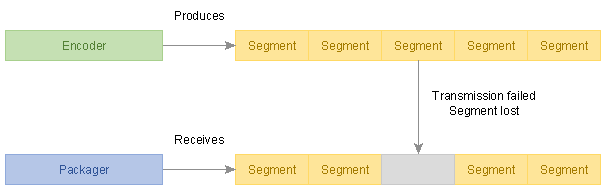
  <figcaption>A DASH packager might not have every Media Segment available when
  it needs to publish them. Corrective actions must be taken to ensure an
  uninterrupted timeline is presented to DASH clients.</figcaption>
</figure>

DASH services shall not publish Periods that have missing segments, whether the
segment loss is described by "missing content segments" ([[!MPEGDASH]] clause
6.2.6) or by any other means (including not describing it).

<figure>
  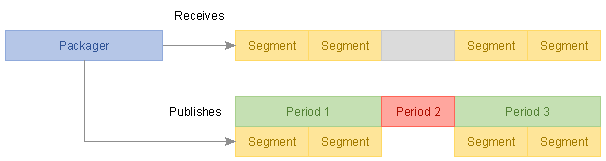
  <figcaption>The simplest correction is to start a new Period that does not
  include the affected Representation for the duration of the loss. Other
  Representations remain present and a client can often continue seamless
  playback without the missing Representation.</figcaption>
</figure>

Instead, DASH services should start a new Period that does not include the
Representation that would experience a gap, later restoring the Representation
with a new Period transition. Period-connected Adaptation Sets can enable DASH
clients to perform such transitions seamlessly in some scenarios.

<figure>
  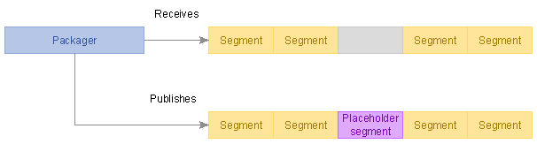
  <figcaption>Other solutions might involve replacing the missing Media Segment
  with a placeholder, either from a different Representation or an entirely
  artificial one.</figcaption>
</figure>

Note: Some DASH clients experience difficulties when transitioning to/from a very
short Period (e.g. with a duration of only 1 Media Segment). Implementations
may extend the transition Period for better compatibility with such clients.

Alternatively, given a sufficiently capable DASH packager and provided that
technical constraints of Representations are satisfied, the missing Media Segment
may be replaced with an aligned Media Segment from a lower bitrate.

# Stand-alone Text Track Timing # {#standalone-text-timing}

Some services store text Adaptation Sets in stand-alone IMSC1 or WebVTT files,
without segmentation or [[!ISOBMFF]] encapsulation.

Note: Storing text tracks in stand-alone files is not permitted by [[!MPEGCMAF]].
If a DASH service is intended to conform to [[!MPEGCMAF]], text tracks shall be
stored as segmented CMAF tracks.

Timecodes in stand-alone text files shall be relative to the Period start point.

`@presentationTimeOffset` shall not be present in the Representation and shall
be ignored by clients if present.

# Forbidden Techniques # {#forbidden-techniques}

Some aspects of [[!MPEGDASH]] are not compatible with the interoperable timing
model defined in this document. In the interest of clarity, they are explicitly
listed here:

- The `@presentationDuration` attribute shall not be used. This information
    serves no purpose under the interoperable timing model.
- The `@availabilityTimeComplete` attribute shall not be used. The concept of
    "incomplete but available" Media Segments that this attribute enables is not
    part of the interoperable timing model.
- There shall not be "missing content segments" ([[!MPEGDASH]] clause 6.2.6) in
    the content. If content is lost during processing, the expectation is that the
    encoder/packager will either replace it with valid content (e.g. content from
    a lower Representation or blank picture or silent audio) or start a new Period
    that does not contain the Representation that incurs data loss (see
    [[#segment-loss-handling]]).

# Timing Constraints # {#timing-constraints}

## Large Timescales and Time Values ## {#timescale-constraints}

[[!ECMASCRIPT]] is unable to accurately represent numeric values greater than 253 (`9007199254740991`) using built-in types. Therefore, interoperable services cannot use such values.

All timescales and start times used in a DASH presentation shall be sufficiently small that no timecode value exceeding 253 will be encountered, even during the publishing of long-lasting live services.

Note: This may require the use of 64-bit fields, although the values must still be limited to under 253.

The issue does not arise with the common 90 KHz timescale. Counting time since the Unix epoch until 11 November 2019 we get `141721093260000` which is well within the allowed range of values.

Another common timescale is 10000000 (10 million timescale units per second) often used by Smooth Streaming. Counting time since the Unix epoch until 11 November 2019 we get `15746788140000000` which does exceed the critical value and will result in broken playback on many clients! To correct such an error, use a smaller timescale or an MPD timeline zero point that is not so far in the past.

## Representing Durations in XML ## {#xml-duration-constraints}

All units expressed in MPD fields of datatype `xs:duration` shall be treated as fixed size:

* 60S = 1M (minute)
* 60M = 1H
* 24H = 1D
* 30D = 1M (month)
* 12M = 1Y

MPD fields having datatype `xs:duration` shall not use the year and month units and should be expressed as a count of seconds, without using any of the larger units.

# Open Issues and Work Items # {#open-issues}

The following work items remain before Part 2 can be considered complete:

<table class="data">
  <caption>Part 2 open issues and topics to progress.</caption>
  <thead><tr><th>Topic<th>Status<th>Source grounding<th>Next action
  <tbody>
    <tr><td>Overview clause<td>Drafted<td>`dashif-iop-v5-part2-draft#10`<td>Replace the draft's "To be done" with reviewed overview text.
    <tr><td>CMAF structural model figure<td>Open<td>`dashif-iop-v5-part2-draft#13..#17`<td>Redraw the CMAF content model as a clean diagram or table.
    <tr><td>SegmentTemplate parameter table<td>Open<td>`dashif-iop-v5-part2-draft#45..#51`<td>Recreate Table 5 (M/O/defaults for Number+Duration, Number+SegmentTimeline, Time+SegmentTimeline).
    <tr><td>Segment-list computation formulae<td>Partial<td>`dashif-iop-v5-part2-draft#46..#51`; `dashif-iop-v4-3#75..#80`<td>Carry over only formulae that add interoperability value beyond current MPEG-DASH.
    <tr><td>Subsegment information<td>Partial<td>`dashif-iop-v5-part2-draft#52..#56`<td>Complete relationship to CMAF chunks and Part 4 low-latency.
    <tr><td>Good Multi-Period CMAF Content<td>Partial<td>`dashif-iop-v5-part2-draft#73..#93`; `dashif-iop-v4-3#90`<td>Complete continuous-boundary requirements and profile signalling; align with Part 5.
    <tr><td>Bandwidth signalling<td>Partial<td>`dashif-iop-v5-part2-draft#94..#97`<td>Define exact `@bandwidth` interpretation and validator expectations.
    <tr><td>Static/dynamic split<td>Partial<td>`dashif-iop-v5-part2-draft#98..#104`; `dashif-iop-v4-3#74..#80`<td>Deduplicate with Part 3 and Part 4.
    <tr><td>MPD updates<td>Partial<td>`dashif-iop-v5-part2-draft#105..#108`<td>Consolidate with live-service update rules in Part 4.
    <tr><td>Locations/BaseURL<td>Partial<td>`dashif-iop-v5-part2-draft#109..#110`<td>Add normative client and content-author guidance.
    <tr><td>Gap handling<td>Open<td>`dashif-iop-v5-part2-draft#111..#115`<td>Complete service-offering and client-processing rules.
    <tr><td>Content annotation framework<td>Open<td>`dashif-iop-v5-part2-draft#116..#129`<td>Reconcile with media parts and event/metadata parts.
</table>

# Change History # {#change-history}

<table class="data">
  <caption>Part 2 change history.</caption>
  <thead><tr><th>Version<th>Date<th>Change
  <tbody>
    <tr><td>0.1<td>Initial<td>Consolidated initial Bikeshed draft from the Part 2 working draft and carried-over v4.3 timing/on-demand/multi-period basics; added explicit open issues.
</table>
