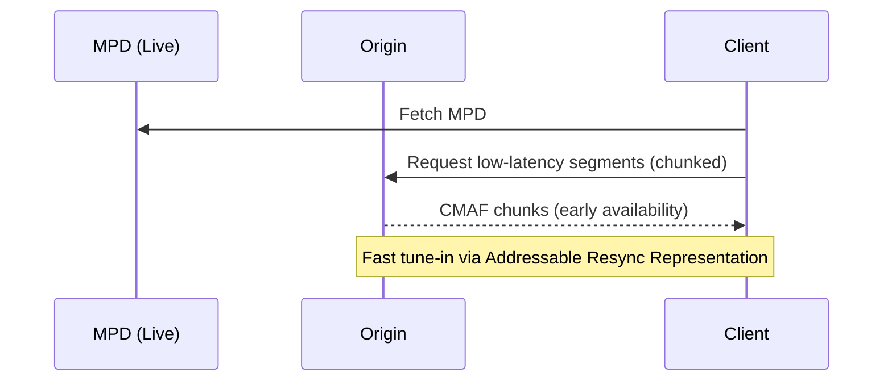

# Diagrams

Text-based diagram sources for Part 4. Two conventions are supported:

## Mermaid (preferred for new/redrawn diagrams)

Author inline in the `.inc.md` with a fenced block or `<pre class=mermaid>`, or
keep a standalone `.mmd` here and paste it in. Mermaid renders in Bikeshed and
natively on GitHub, and the source is diffable in pull requests.



## PlantUML (DASH-IF convention for UML)

Place `*.wsd` / `*.puml` files here; the DASH-IF build pipeline renders them to
images. Example (`example.wsd`):

```
@startuml
Client -> Origin : request segment
Origin --> Client : CMAF chunk
@enduml
```

## Which to use

- Flow / sequence / architecture / state -> **Mermaid**
- Formal UML -> **PlantUML** (`.wsd`)
- Complex bespoke figures that fit no grammar -> **draw.io**, export `*.drawio.svg` to `Images/`
- Screenshots / photos -> keep original raster in `Images/`
