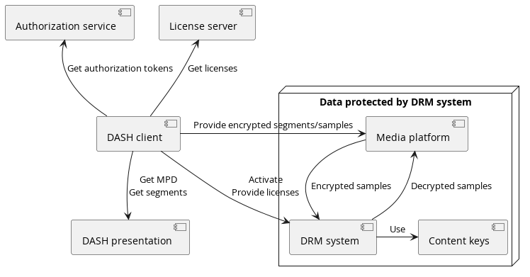
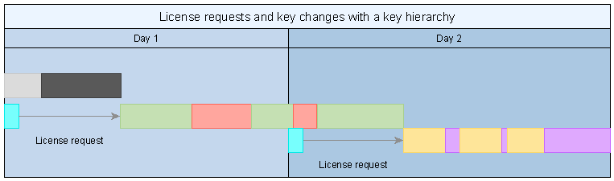

# Scope # {#Scope}
This document is an update to the "Content Protection and Security" section of the DASH-IF IOP Guidelines version 4.3. The scope remains the same, giving guidelines for interoperable behaviors of clients in front of well formed encrypted content. Some updates have been made. This means:
* Updated encrypted content constraints for supporting CMAF. This includes the addition of the cbcs scheme support and recommendation for encrypting content when available using both cbcs and cenc protection schemes.

Note: ETSI TS 103 285 [[DVBDASH]] (the "DVB-DASH" profile) defines its own
content protection constraints for `cenc`-protected content, including CENC
signalling, key rotation, and HDCP output control. Alignment notes with
DVB-DASH are provided in the relevant clauses below.

In addition, this document introduces:
* The DASH-IF XML schema where three elements are defined. These elements are namely the <b>`Laurl`</b> (License acquisition server URL), the <b>`Certurl`</b> (Certificate acquisition server URL), and the <b>`Authzurl`</b> (Authorization server URL).
* A new option using the `seig` box but without key hierarchy for supporting key rotation.
* The Enhanced Clear Key Content Protection (ECCP), a content protection mechanism for DASH content which provides greater protection than TLS delivery, token authentication or Clear Key used individually.

# Definition of terms and abbreviations # {#Definition}
## Terms ## {#Terms}
For the purposes of the present document, the following terms apply:

**content**: one or more audio-visual elementary streams and the associated <b>`MPD`</b>.

## Abbreviations ## {#Abbreviations}
For the purposes of the present document, the following abbreviations apply:

<table class="data">
	<thead>
		<tr><th>Abbreviation<th>Meaning
	<tbody>
		<tr><td>API<td>Application Programming Interface
		<tr><td>CDN<td>Content Delivery Network
		<tr><td>CMAF<td>Common Media Application Format
		<tr><td>CPU<td>Central Processing Unit
		<tr><td>DASH<td>Dynamic Adaptive Streaming over HTTP
		<tr><td>DRM<td>Digital Rights Management
		<tr><td>EME<td>Encrypted Media Extension
		<tr><td>HDCP<td>High-bandwidth Digital Content Protection
		<tr><td>HDMI<td>High-Definition Multimedia Interface
		<tr><td>HTTP<td>HyperText Transfer Protocol
		<tr><td>HTTPS<td>HyperText Transfer Protocol Secure
		<tr><td>JSON<td>JavaScript Object Notation
		<tr><td>MPD<td>Media Presentation Description
		<tr><td>KID<td>Key Identifier
		<tr><td>TLS<td>Transport Layer Security
		<tr><td>URI<td>Uniform Resource Identifier
		<tr><td>URL<td>Uniform Resource Locator
		<tr><td>UUID<td>Universally Unique identifier
		<tr><td>W3C<td>World Wide Web Consortium
		<tr><td>XML<td>Extensible Markup Language
</table>

# Core concepts of content protection and security # {#Core}
## Introduction ## {#Core-Introduction}
A DRM system cooperates with the device's media platform to enable playback of encrypted content while protecting the decrypted samples and content keys against potential attacks. This document focuses on the signaling in the DASH presentation and on the interactions of the DASH client with other components. This document does not define any DRM system. DASH-IF maintains a registry of DRM system identifiers at https://dashif.org/identifiers/content_protection/.

The following figure provides a high level view of the different elements involved in the rendering of encrypted content.

<figure>
	
	<figcaption>Core elements in content protection.</figcaption>
</figure>

Common Encryption [[!MPEGCENC]] specifies several protection schemes which can be applied by a scrambling system and used by different DRM systems. The same encrypted DASH presentation can be decrypted by different DRM systems if a DASH client is provided the DRM system configuration for each DRM system, either in the <b>`MPD`</b> or at runtime.

A content key is a key (usually 128-bit) used by a DRM system to make content available for playback. It is identified by a string called `default_KID` and/or `KID`. The format constraints of the string are defined in [[!MPEGCENC]]. While the `default_KID` format visually resembles a `UUID` when in the <b>`MPD`</b>, it is not exactly the same. `UUIDs` have constraints on the byte values permitted at certain positions in the data structure, whereas [[!MPEGCENC]] sets no constraints on the values in `default_KID`, it only defines the format of the string.

A content key and its identifier are shared between all DRM systems, whereas the mechanisms used for key acquisition and content protection are largely DRM system specific. DASH adaptation sets are often protected by different content keys.

A license is a data structure in a DRM system specific format that contains one or more content keys and associates them with a policy that governs the usage of the content keys (e.g. expiration time). The encapsulated content keys are typically encrypted and only readable by the DRM system.

## Client reference architecture for content playback ## {#ReferenceArchitecture}
Different software architectural components are involved in playback of encrypted content. The exact nature depends on the specific implementation. A high-level reference architecture is described in the figure below.

<figure>
	
	<figcaption>Reference architecture for encrypted content playback.</figcaption>
</figure>

The media platform provides one or more APIs that allow the device's media playback and DRM capabilities to be used by a DASH client. The DASH client is typically a library included in an app. On some device types, the DASH client may be a part of the media platform.

This document assumes that the media platform exposes its encrypted content playback features via an API similar to W3C EME [[!EME]]. The technical nature of the API may be different but EME-equivalent functionality is expected.

The media platform often implements at least one DRM system. Additional DRM system implementations can be included as libraries in the app.

A DRM system is an implementation of content keys management. It is made of two main components: A license server for generating licenses and a DRM client for processing licenses and enforcing the associated policies. On some paltforms, the DRM client may handle the decryption of samples while on other platforms, decryption is handled by e.g. hardware elements the DRM client interacts with.

## Compliances and robustness rules ## {#Compliances}

DRM systems define some rules, called compliance rules and robustness rules, that govern how they interact with the device and how they can be implemented. These two set of rules define many things among which are the output control rules and the different robustness levels which are typically used to differentiate implementations based on their resistance to attacks.

There can be many different ouputs on a devices, from HDMI to IP connection and possibly analog output. For each output, there may be some protection mechanisms, HDCP for HDMI for example, and for every of this protection mechanism, the DRM system may or may not allow outputing content. There can be rules such as a minimum version for the protection mechanism, or if no protection mechanims exist, output may not be allowed. All these rules are defined per DRM. In order to properly select content that may be rendered, DASH allows announcing the expected output protection. See [[#SignalingHDCP]] for more details.

For the robustness rules, the set of robustness levels, their names and the constraints that apply are all specific to each DRM system. As an example, a hypothetical DRM system might define the following robustness levels:

* High: All cryptographic operations are performed on a separate CPU not accessible to the device's primary operating system (often called a trusted execution environment). Decrypted data only exists in a memory region not accessible to the device's primary operating system (often called a secure media path).
* Medium: All cryptographic operations are performed on a separate CPU not accessible to the device's primary operating system. Decrypted data may be passed to the primary operating system's media platform APIs.
* Low: All operations are performed in software that can be inspected and modified by the user. Software obfuscation techniques are to be used to protect against analysis.
* None: For development only. Implementation does not resist attacks.

Policy associated with content can require a DRM system implementation to conform to a certain robustness level, thereby ensuring that valuable content does not get presented on potentially vulnerable implementations. This policy can be enforced on different levels, depending on the DRM system:
1. A license server may refuse to provide content keys to implementations with unacceptable robustness levels.
2. The DRM system may refuse to use content keys whose license requires a higher robustness level than the implementation provides.

Multiple implementations of a DRM system may be available to a DASH client, potentially at different robustness levels. The DASH client has to choose at media load time which DRM system implementation to use. However, the required robustness level may be different for different device types and is not expressed in the <b>`MPD`</b>, only the expected robustness level for playing back content can be exposed in the <b>`MPD`</b>. See [[#SignalingDRM]] for more details.

## W3C Encrypted Media Extensions ## {#W3CEME}
Whereas the DRM signaling in DASH deals with DRM systems, EME deals with key systems. While similar in concept, they are not always the same thing. A single DRM system may be implemented on a single device by multiple different key systems, with different codec compatibility and functionality, potentially at different robustness levels.

As an example, a device may implement the "ExampleDRM" DRM system as a number of EME key systems:
* The key system "ExampleDRMvariant1" may support playback of encrypted H.264 and H.265 content at up to 1080p resolution with "low" robustness level.
* The key system "ExampleDRMvariant2" may support playback of encrypted H.264 content at up to 4K resolution with "high" robustness level.
* The key system "ExampleDRMvariant3" may support playback of encrypted H.265 content at up to 4K resolution with "high" robustness level.

Even if multiple variants are available, a DASH client should map each DRM system to a single key system. The default key system should be the one the DASH client expects to offer greatest compatibility with content (potentially at a low robustness level). The DASH client should allow solution-specific logic and configuration to override the key system chosen by default (e.g. to force the use of a high-robustness variant).

# DASH-IF XML schema # {#Schema}
## Introduction ## {#Schema-Introduction}
This clause defines elements that can be added in the <b>`MPD`</b> allowing to provide information on license acquisition and authorization servers that are available for every DRM system.

The full schema is defined in [[#XMLSchema]]. The following is describing the elements.

## License acquisition URL ## {#LAURL}
One or more <b>`Laurl`</b> elements may be added under the <b>`ContentProtection`</b> descriptor. It contains the URL for a license server allowing to retrieve a license in the format specific to the DRM system that is described by the <b>`ContentProtection`</b> descriptor. It has the optional attribute `@licenseType` that is a string describing the license type served by this license server. The meaning of this attribute is DRM specific.

Examples can be found in [[#ContentID]] and [[#ClearKey]].

## Authorization server URL ## {#AUTHURL}
One or more <b>`Authzurl`</b> elements may be added under the <b>`ContentProtection`</b> descriptor. It contains the URL for an authorization server allowing to receive authorization tokens that may be required for requesting a license from a license server. It has the optional attribute `@authzType` that is a string describing the authorization token type served by this authorization server. The meaning of this attribute is specific to the server serving the token.

Examples can be found in [[#ContentID]].

## Certificate acquisition URL ## {#CERTURL}
One or more <b>`Certurl`</b> elements may be added under the <b>`ContentProtection`</b> descriptor. It contains the URL for a license server allowing to retrieve a certificate in the format specific to the DRM system that is described by the <b>`ContentProtection`</b> descriptor. It has the optional attribute `@certType` that is a string describing the certificate type served by this license server. The meaning of this attribute is DRM specific.

When present, it is expected that the device first use the URL under this element for retrieving the certificate. This certificate can then be used in a DRM specific manner for requesting a license using the URL provided under one <b>`Laurl`</b> element.

## XML schema ## {#XMLSchema}
The namespace for the DASH-IF <b>`MPD`</b> extensions defined in this document is https://dashif.org/CPS. This document refers to this namespace using the dashif prefix. The schema of the DASH-IF <b>`MPD`</b> extensions is provided on the dashif.org site. It is reproduced below for convenience, the electronic file is the authoritative source.

```xml
<?xml version="1.0" encoding="UTF-8"?>
<xs:schema xmlns:xs="http://www.w3.org/2001/XMLSchema" xmlns:dashif="https://dashif.org/CPS"
	targetNamespace="https://dashif.org/CPS" elementFormDefault="qualified"
	attributeFormDefault="unqualified">
	<xs:element name="Laurl" type="dashif:LaurlType"/>
	<xs:element name="Certurl" type="dashif:CerturlType"/>
	<xs:element name="Authzurl" type="dashif:AuthzurlType"/>
	<xs:complexType name="LaurlType">
		<xs:simpleContent>
			<xs:extension base="xs:anyURI">
				<xs:attribute name="licenseType" type="xs:string" use="optional"/>
				<xs:anyAttribute namespace="##other" processContents="strict"/>
			</xs:extension>
		</xs:simpleContent>
	</xs:complexType>
	<xs:complexType name="CerturlType">
		<xs:simpleContent>
			<xs:extension base="xs:anyURI">
				<xs:attribute name="certType" type="xs:string" use="optional"/>
				<xs:anyAttribute namespace="##other" processContents="strict"/>
			</xs:extension>
		</xs:simpleContent>
	</xs:complexType>
	<xs:complexType name="AuthzurlType">
		<xs:simpleContent>
			<xs:extension base="xs:anyURI">
				<xs:attribute name="authzType" type="xs:string" use="optional"/>
				<xs:anyAttribute namespace="##other" processContents="strict"/>
			</xs:extension>
		</xs:simpleContent>
	</xs:complexType>
</xs:schema>
```

# Content protection constraints for CMAF # {#CMAFConstraints}
## Introduction ## {#Constraints-Introduction}
The structure of content protection related information in the CMAF containers used by DASH is largely specified by [[!MPEGCENC]] and [[!CMAF]] clause 8. This clause outlines some additional requirements to ensure interoperable behavior of DASH clients and services.

NOTE: This document uses the `cenc:` prefix to reference the XML namespace `urn:mpeg:cenc:2013` [[!MPEGCENC]].

## Content protection data ## {#Data}
This clause describes the structure of content protection data in CMAF containers used to provide encrypted content in a DASH presentation, summarizing the requirements defined by [[!MPEGCENC]], [[!CMAF]] and [[!ISOBMFF]].

DASH initialization segments contain:
* Zero or more `moov/pssh` "Protection System Specific Header" boxes ([[!MPEGCENC]] clause 8.1) which provide DRM system initialization data in DRM system specific format.
* Exactly one `moov/trak/mdia/minf/stbl/stsd/sinf/schm` "Scheme Type" box ([[!ISOBMFF]] clause 8.12.5) identifying the protection scheme ([[!MPEGCENC]] clause 4).
* Exactly one `moov/trak/mdia/minf/stbl/stsd/sinf/schi/tenc` "Track Encryption" box ([[!MPEGCENC]] clause 8.2) which contains default encryption parameters for samples. These default parameters may be overridden in media segments.

DASH media segments are composed of a single CMAF fragment that contains:
* Exactly one `moof/traf/senc` "Sample Encryption" box ([[!MPEGCENC]] clause 7.2) which stores initialization vectors (IVs) and, optionally, subsample encryption ranges for samples in the same CMAF fragment.
* Zero or one `moof/traf/saiz` "Sample Auxiliary Information Size" boxes ([[!ISOBMFF]] clause 8.7.8) which references the sizes of the per-sample data stored in the `moof/traf/senc` box ([[!MPEGCENC]] clause 7 and [[!CMAF]] clause 8.2.2). It is omitted if the parameters provided by the senc box are identical for all samples in the CMAF fragment.
* Zero or one `moof/traf/saio` "Sample Auxiliary Information Offset" boxes ([[!ISOBMFF]] clause 8.7.9) which references the sizes of the per-sample data stored in the `moof/traf/senc` box ([[!MPEGCENC]] clause 7 and [[!CMAF]] clause 8.2.2). It is omitted if the parameters provided by the senc box are identical for all samples in the CMAF fragment.
* Zero or more `moof/pssh` "Protection System Specific Header" boxes ([[!MPEGCENC]] clause 8.1) which provide transparent updates to DRM system internal state.
* For each sample group, exactly one `moof/traf/sgpd` "Sample Group Description" box ([[!MPEGCENC]] clause 6 and [[!ISOBMFF]] clause 8.9.3) which contains overrides for encryption parameters defined in the `tenc` box. It is omitted if no parameters are overridden.
* For each sample grouping type (see [[!ISOBMFF]], typically one), exactly one `moof/traf/sbgp` "Sample to Group" box ([[!MPEGCENC]] clause 6 and [[!ISOBMFF]] clause 8.9.2) which associates samples with sample groups. It is omitted if no parameters are overridden.

## Content protection data constraints ## {#DataConstraints}
Initialization segments should not contain any `pssh` box as specified in [[!CMAF]], clause 7.4.3 and clause 8.2.2.3, and DASH clients may ignore such boxes when encountered. Instead, pssh boxes should be placed in the <b>`MPD`</b> as <b>`cenc:pssh`</b> elements in DRM system specific <b>`ContentProtection`</b> descriptors.

NOTE: Placing the `pssh` boxes in the <b>`MPD`</b> has become common for purposes of operational agility, it is often easier to update <b>`MPD`</b> files than rewrite initialization segments when, for example, a new DRM system needs to be supported. Furthermore, in some scenarios the appropriate set of `pssh` boxes is not known when the initialization segment is created.

Protected content may be published without any `pssh` boxes in both the <b>`MPD`</b> and media segments. All DRM system configuration may be provided at runtime, including the `pssh` box data.

Media segments may contain `moof/pssh` boxes ([[!CMAF]] clause 7.4.3) to provide updates to the DRM system internal state (e.g. to supply new leaf keys in a key hierarchy). These state updates may be transparent to a DASH client on some media platforms that intercept the `moof/pssh` boxes and supply them directly to the active DRM system; on other media platforms, the DASH client may need to extract and forward the `moof/pssh` boxes to the DRM system. When using CMAF chunks for delivery, each CMAF fragment may be split into multiple CMAF chunks. If the CMAF fragment contained any `moof/pssh` boxes, copies of these boxes shall be present in each CMAF chunk that starts with an independent media sample.

NOTE: While DASH only requires the presence of `moof/pssh` in the first CMAF chunk, the requirement is more extensive in the interest of HLS interoperability [[HLS]].

## Content encryption ## {#Encryption}
A DASH presentation may provide some or all adaptation sets in encrypted form, requiring the use of a DRM system to decrypt the content for playback. The duty of a DRM system is to prevent disclosure of the content key and misuse of the decrypted content (e.g. recording via screen capture software) and may be to decrypt content.

In a DASH presentation, every representation in an adaptation set shall be protected using the same content key (identified by the same `default_KID` or `KID)`. This means that if representations use different content keys, they shall be in different adaptation sets, even if they would otherwise (were they not encrypted) belong to the same adaptation set. A `urn:mpeg:dash:adaptation-set-switching:2016` supplemental property descriptor ([[!MPEGDASH]] clause 5.3.3.5) shall be used to signal that such adaptation sets are suitable for switching.

Encrypted DASH content shall use either the `cenc` or the `cbcs` protection scheme defined in [[!MPEGCENC]] and as constrained in [[!CMAF]] clause 8.2.3.

NOTE: `cenc` and `cbcs` are two mutually exclusive protection schemes. DASH content encrypted according to the `cenc` protection scheme cannot be decrypted by a DRM system supporting only the `cbcs` protection scheme and vice versa.

Some DRM system implementations support both protection schemes. Even when this is the case, clients shall not concurrently consume encrypted content that uses different protection schemes.

Representations in the same adaptation set shall use the same protection scheme. Representations in different adaptation sets may use different protection schemes. If both protection schemes are used in the same period, all encrypted representations in that period shall be provided using both protection schemes.

Representations that contain the same media content using different protection schemes should use different content keys. This protects against some cryptographic attacks [[!EncryptionModes]].

Note: DVB-DASH [[DVBDASH]] requires protected content to use the `cenc`
protection scheme exclusively; `cbcs`-only content is not guaranteed to be
supported by a DVB-DASH client. Services that need to serve both DVB-DASH and
non-DVB-DASH players should provide `cenc`-protected representations for
DVB-DASH compatibility, using `cbcs` only as an additional, non-exclusive
protection scheme per [[#Encryption]].

# Content protection constraints for the MPD # {#MPDConstraints}
## Introduction ## {#MPDConstraints-Introduction}
A DASH client needs to recognize encrypted content to activate a suitable DRM system and configure it to decrypt content. The <b>`MPD`</b> informs a DASH client of the protection scheme used to protect content, identifies the content keys that are used and optionally provides the default DRM system configuration for a set of DRM systems.

The DRM system configuration is the complete data set required for a DASH client to activate a single DRM system and configure it to decrypt content using a single content key. The DRM system configuration often contains:
* DRM system initialization data in the form of a DRM system specific `pssh` box (as defined in [[!MPEGCENC]]).
* DRM system initialization data in some other DRM system specific form (e.g. keyids JSON structure used by W3C Clear Key)
* The used protection scheme (`cenc` or `cbcs`)
* `default_KID` that identifies the content key
* License server URL
* Authorization service URL

## Signaling encrypted content ## {#SignalingContent}
The presence of a <b>`ContentProtection`</b> descriptor with `@schemeIdUri="urn:mpeg:dash:mp4protection:2011"` on an adaptation set informs a DASH client that all representations in the adaptation set are encrypted in conformance to Common Encryption ([[!MPEGCENC]] clause 11 and [[!MPEGDASH]] clauses 5.8.4.1 and 5.8.5.2) and require a DRM system to provide access.

This descriptor is present for all encrypted content ([[!MPEGDASH]] clause 5.8.4.1). It shall be defined on the adaptation set level as specified in [[!MPEGDASH]], clause 8.12.4.3. The value attribute indicates the used protection scheme ([[!MPEGDASH]] clause 5.8.5.2). The `@cenc:default_KID` shall be present if the media segment do not carry `sgpd` boxes that contain `KID` overwritting the `default_KID` value and have a value matching the `default_KID` in the `tenc` box.

As an example, the following snippet of an <b>`MPD`</b> signals an adaptation set encrypted using the `cbcs` scheme and with a content key identified by `34e5db32-8625-47cd-ba06-68fca0655a72`.

```xml
<ContentProtection schemeIdUri="urn:mpeg:dash:mp4protection:2011" value="cbcs" cenc:default_KID="34e5db32-8625-47cd-ba06-68fca0655a72" /\>
```
The `tenc` box stores `default_KID` as a 16-byte array. The byte order shall be identical in the binary structure and the string-form `@cenc:default_KID`.

The following are two equivalent forms of representing the same `default_KID`:
* In string form `00010203-0405-0607-0809-0a0b0c0d0e0f`
* In binary form `0x00, 0x01, 0x02, 0x03, 0x04, 0x05, 0x06, 0x07, 0x08, 0x09, 0x0a, 0x0b, 0x0c, 0x0d, 0x0e, 0x0f`

Some Windows-targeting software libraries implement "Microsoft style" `UUID` serialization that changes the order of bytes when transforming between string form and binary form. This is not appropriate when serializing/deserializing `default_KID` values. Linux-based tooling typically does not change the byte order.

## Signaling DRM system information ## {#SignalingDRM}
A DASH service shall supply DRM system configuration in the <b>`MPD`</b> for all supported DRM systems in all encrypted adaptation sets.

At least one <b>`ContentProtection`</b> descriptors shall be present in the <b>`MPD`</b> to provide DRM system configuration as specified in [[!MPEGDASH]], clause 8.12.4.3. It shall be defined at the adaptation set level.

A <b>`ContentProtection`</b> descriptor providing a default DRM system configuration shall use `@schemeIdUri="urn:uuid:\<systemid\>"` to identify the DRM system, with the `\<systemid\>` matching a value in the DASH-IF system-specific identifier registry. The `@value` attribute of the <b>`ContentProtection`</b> descriptor should contain the DRM system name and version number in a human readable form (for diagnostic purposes).

DRM systems generally use the concept of license requests as the mechanism for obtaining content keys and associated usage constraints. For DRM systems that use this concept, one or more <b>`Laurl`</b> elements should be present under the <b>`ContentProtection`</b> descriptor, with the value of the element being the URL to send license requests to. This URL may contain content identifiers, see [[#ContentID]] for more details.

For DRM systems that require proof of authorization to be attached to the license request, one or more <b>`Authzurl`</b> elements should be present under the <b>`ContentProtection`</b> descriptor, containing the default URL to send authorization requests to.

Multiple <b>`Laurl`</b> or <b>`Authzurl`</b> elements under the same <b>`ContentProtection`</b> descriptor define sets of equivalent alternatives for the DASH client to choose from. A DASH client should select a random item from the set every time the value of such an element is used if the attributes of the elements have the same values.

The following is an example of a <b>`ContentProtection`</b> descriptor that provides default DRM system configuration for a fictional DRM system.

```xml
<ContentProtection schemeIdUri="urn:uuid:d0ee2730-09b5-459f-8452-200e52b37567" value="FirstDRM2.0">
	<cenc:pssh>
		YmFzZTY0IGVuY29kZWQgY29udGVudHMgb2YgkXBzc2iSIGJveCB3aXRoIHRoaXMgU3lzdGVtSUQ=
	</cenc:pssh>
	<dashif:Authzurl>https://example.com/tenants/5341/authorize</dashif:Authzurl>
	<dashif:Certurl>https://example.com/AcquireCertificate</dashif:Certurl>
	<dashif:Laurl>https://example.com/AcquireLicense</dashif:Laurl>
</ContentProtection>
```

The contents of DRM system specific <b>`ContentProtection`</b> descriptors with the same `@schemeIdUri` shall be identical in all adaptation sets with the same `@default_KID`. This means that a DRM system will treat equally all adaptation sets that use the same content key.

NOTE: For changing the default DRM system configuration associated with a content key, all the instances where the data is present in the <b>`MPD`</b> have to be updated. For live services, this can mean updating the data in multiple periods.

The <b>`ContentProtection`</b> descriptor may include a `@robustness` attribute. The value of this attribute is DRM specific. It announces what robustness level is expected from the DRM system for the representations that are part of the adaptation set. It allows the DASH client to make a more educated choice when selecting a DRM system for playing back content or to not consider some adaptation sets when there is no suitable DRM system on the device.

In order to leverage this value, the DASH client needs to know the robustness level of the different DRM systems supported by the platform. There is no recommended API for getting this information.

NOTE: If using W3C EME [[!EME]], the `@robustness` value can be compared to the value of the robustness member of MediaKeySystemMediaCapability for selecting a key system to activate. The DASH client selects then a key system with the requested robustness level.

It may happen that even if the DASH client selected a DRM system that should allow playling the representations of the adaptation set, playback fails, it is most likely due to a key failure because the DRM system did not release the content key based on its own evaluation of the requested robustness level compared to that of the platform. In this case, the DASH client shall try playing back representations from another adaptation set with lower resolution (with less restrictive robustness requirements).

If a DASH client selects several adaptation sets for playback that have different robustness requirements, it shall enforce the highest robustness level among those present in the different <b>`ContentProtection`</b> descriptor.

NOTE: For every DRM system, it is very likely that the highest robustness level is requested for the adaptation set containing the representations with the highest resolution.

The following is an example of a <b>`MPD`</b> that includes two representations in two adaptation sets protected by two DRMs, the content key is different per adaptation set. It is possible to seamless switch between the adaptation sets. Because some representations are at high resolutions, the robustness level required for this adaptation set is "higher" meaning requiring a "more secure" implementation of the DRM client. In this example, a DASH client selecting both adaptation sets for playing back content will look for a DRM system that enforces the SL3000 or L1 robustness levels irrespective from which representation is selected for starting playing back.

```xml
<?xml version="1.0" encoding="utf-8"?>
<MPD xmlns="urn:mpeg:dash:schema:mpd:2011" minBufferTime="PT1.500S" type="static" mediaPresentationDuration="PT0H24M28.000S" maxSegmentDuration="PT0H0M4.000S" profiles="urn:mpeg:dash:profile:isoff-live:2011,https://dashif.org/guidelines/dash264" xmlns:cenc="urn:mpeg:cenc:2013">
	<Period duration="PT0H12M14.000S">
		<AdaptationSet segmentAlignment="true" id="1" group="1" maxWidth="1920" maxHeight="1080" maxFrameRate="24" par="16:9" lang="und">
			<SupplementalProperty schemeIdUri="urn:mpeg:dash:adaptation-set-switching:2016" value="2"/>
			<ContentProtection schemeIdUri="urn:mpeg:dash:mp4protection:2011" value="cenc" cenc:default_KID="c14f0709-f2b9-4427-916b-61b52586506a"/>
			<ContentProtection value="MSPR 2.0" schemeIdUri="urn:uuid:9a04f079-9840-4286-ab92-e65be0885f95" robustness="SL2000">
				<cenc:pssh>
					AAAB5HBzc2gAAAAAmgTweZhAQoarkuZb4IhflQAAAcTEAQAAAQABALoBPABXAFIATQBIAEUAQQBEAEUAUgAgAHgAbQBsAG4AcwA9ACIAaAB0AHQAcAA6AC8ALwBzAGMAaABlAG0AYQBzAC4AbQBpAGMAcgBvAHMAbwBmAHQALgBjAG8AbQAvAEQAUgBNAC8AMgAwADAANwAvADAAMwAvAFAAbABhAHkAUgBlAGEAZAB5AEgAZQBhAGQAZQByACIAIAB2AGUAcgBzAGkAbwBuAD0AIgA0AC4AMAAuADAALgAwACIAPgA8AEQAQQBUAEEAPgA8AFAAUgBPAFQARQBDAFQASQBOAEYATwA+ADwASwBFAFkATABFAE4APgAxADYAPAAvAEsARQBZAEwARQBOAD4APABBAEwARwBJAEQAPgBBAEUAUwBDAFQAUgA8AC8AQQBMAEcASQBEAD4APAAvAFAAUgBPAFQARQBDAFQASQBOAEYATwA+ADwASwBJAEQAPgBDAFEAZABQAHcAYgBuAHkASgAwAFMAUgBhADIARwAxAEoAWQBaAFEAYQBnAD0APQA8AC8ASwBJAEQAPgA8AC8ARABBAFQAQQA+ADwALwBXAFIATQBIAEUAQQBEAEUAUgA+AA==
				</cenc:pssh>
				<pro xmlns="urn:microsoft:playready">
					xAEAAAEAAQC6ATwAVwBSAE0ASABFAEEARABFAFIAIAB4AG0AbABuAHMAPQAiAGgAdAB0AHAAOgAvAC8AcwBjAGgAZQBtAGEAcwAuAG0AaQBjAHIAbwBzAG8AZgB0AC4AYwBvAG0ALwBEAFIATQAvADIAMAAwADcALwAwADMALwBQAGwAYQB5AFIAZQBhAGQAeQBIAGUAYQBkAGUAcgAiACAAdgBlAHIAcwBpAG8AbgA9ACIANAAuADAALgAwAC4AMAAiAD4APABEAEEAVABBAD4APABQAFIATwBUAEUAQwBUAEkATgBGAE8APgA8AEsARQBZAEwARQBOAD4AMQA2ADwALwBLAEUAWQBMAEUATgA+ADwAQQBMAEcASQBEAD4AQQBFAFMAQwBUAFIAPAAvAEEATABHAEkARAA+ADwALwBQAFIATwBUAEUAQwBUAEkATgBGAE8APgA8AEsASQBEAD4AQwBRAGQAUAB3AGIAbgB5AEoAMABTAFIAYQAyAEcAMQBKAFkAWgBRAGEAZwA9AD0APAAvAEsASQBEAD4APAAvAEQAQQBUAEEAPgA8AC8AVwBSAE0ASABFAEEARABFAFIAPgA=
				</pro>
			</ContentProtection>
			<ContentProtection value="Widevine" schemeIdUri="urn:uuid:edef8ba9-79d6-4ace-a3c8-27dcd51d21ed" robustness="L3">
				<cenc:pssh>AAAANHBzc2gAAAAA7e+LqXnWSs6jyCfc1R0h7QAAABQIARIQwU8HCfK5RCeRa2G1JYZQag==</cenc:pssh>
			</ContentProtection>
			<SegmentTemplate timescale="1200000" media="$RepresentationID$/$Number%04d$.m4s" startNumber="1" duration="4799983" initialization="$RepresentationID$/init.mp4"/>
			<Representation id="1" mimeType="video/mp4" codecs="avc1.64001f" width="512" height="288" frameRate="24" sar="1:1" startWithSAP="1" bandwidth="389802"></Representation>
			<Representation id="2" mimeType="video/mp4" codecs="avc1.64001f" width="640" height="360" frameRate="24" sar="1:1" startWithSAP="1" bandwidth="764935"></Representation>
			<Representation id="3" mimeType="video/mp4" codecs="avc1.640028" width="852" height="480" frameRate="24" sar="640:639" startWithSAP="1" bandwidth="1120439"></Representation>
		</AdaptationSet>
		<AdaptationSet segmentAlignment="true" id="2" group="1" maxWidth="3840" maxHeight="2160" maxFrameRate="24" par="16:9" lang="und">
			<SupplementalProperty schemeIdUri="urn:mpeg:dash:adaptation-set-switching:2016" value="1" />
			<ContentProtection schemeIdUri="urn:mpeg:dash:mp4protection:2011" value="cenc" cenc:default_KID="8b029e51-d56a-44bd-910f-d4b5fd90fba2"/>
			<ContentProtection value="MSPR 2.0" schemeIdUri="urn:uuid:9a04f079-9840-4286-ab92-e65be0885f95" robustness="SL3000">
				<cenc:pssh>
					AAAB5HBzc2gAAAAAmgTweZhAQoarkuZb4IhflQAAAcTEAQAAAQABALoBPABXAFIATQBIAEUAQQBEAEUAUgAgAHgAbQBsAG4AcwA9ACIAaAB0AHQAcAA6AC8ALwBzAGMAaABlAG0AYQBzAC4AbQBpAGMAcgBvAHMAbwBmAHQALgBjAG8AbQAvAEQAUgBNAC8AMgAwADAANwAvADAAMwAvAFAAbABhAHkAUgBlAGEAZAB5AEgAZQBhAGQAZQByACIAIAB2AGUAcgBzAGkAbwBuAD0AIgA0AC4AMAAuADAALgAwACIAPgA8AEQAQQBUAEEAPgA8AFAAUgBPAFQARQBDAFQASQBOAEYATwA+ADwASwBFAFkATABFAE4APgAxADYAPAAvAEsARQBZAEwARQBOAD4APABBAEwARwBJAEQAPgBBAEUAUwBDAFQAUgA8AC8AQQBMAEcASQBEAD4APAAvAFAAUgBPAFQARQBDAFQASQBOAEYATwA+ADwASwBJAEQAPgBVAFoANABDAGkAMgByAFYAdgBVAFMAUgBEADkAUwAxAC8AWgBEADcAbwBnAD0APQA8AC8ASwBJAEQAPgA8AC8ARABBAFQAQQA+ADwALwBXAFIATQBIAEUAQQBEAEUAUgA+AA==
				</cenc:pssh>
				<pro xmlns="urn:microsoft:playready">
					xAEAAAEAAQC6ATwAVwBSAE0ASABFAEEARABFAFIAIAB4AG0AbABuAHMAPQAiAGgAdAB0AHAAOgAvAC8AcwBjAGgAZQBtAGEAcwAuAG0AaQBjAHIAbwBzAG8AZgB0AC4AYwBvAG0ALwBEAFIATQAvADIAMAAwADcALwAwADMALwBQAGwAYQB5AFIAZQBhAGQAeQBIAGUAYQBkAGUAcgAiACAAdgBlAHIAcwBpAG8AbgA9ACIANAAuADAALgAwAC4AMAAiAD4APABEAEEAVABBAD4APABQAFIATwBUAEUAQwBUAEkATgBGAE8APgA8AEsARQBZAEwARQBOAD4AMQA2ADwALwBLAEUAWQBMAEUATgA+ADwAQQBMAEcASQBEAD4AQQBFAFMAQwBUAFIAPAAvAEEATABHAEkARAA+ADwALwBQAFIATwBUAEUAQwBUAEkATgBGAE8APgA8AEsASQBEAD4AVQBaADQAQwBpADIAcgBWAHYAVQBTAFIARAA5AFMAMQAvAFoARAA3AG8AZwA9AD0APAAvAEsASQBEAD4APAAvAEQAQQBUAEEAPgA8AC8AVwBSAE0ASABFAEEARABFAFIAPgA=
				</pro>
			</ContentProtection>
			<ContentProtection value="Widevine" schemeIdUri="urn:uuid:edef8ba9-79d6-4ace-a3c8-27dcd51d21ed" robustness="L1">
				<cenc:pssh>AAAANHBzc2gAAAAA7e+LqXnWSs6jyCfc1R0h7QAAABQIARIQiwKeUdVqRL2RD9S1/ZD7og==</cenc:pssh>
			</ContentProtection>
			<SegmentTemplate timescale="1200000" media="$RepresentationID$/$Number%04d$.m4s" startNumber="1" duration="4799983" initialization="$RepresentationID$/init.mp4"/>
			<Representation id="4" mimeType="video/mp4" codecs="hev1.2.4.L93.90" width="1280" height="720" frameRate="24" sar="1:1" startWithSAP="1" bandwidth="1474186"></Representation>
			<Representation id="5" mimeType="video/mp4" codecs="hev1.2.4.L120.90" width="1920" height="1080" frameRate="24" sar="1:1" startWithSAP="1" bandwidth="1967542"></Representation>
			<Representation id="6" mimeType="video/mp4" codecs="hev1.2.4.L150.90" width="2560" height="1440" frameRate="24" sar="1:1" startWithSAP="1" bandwidth="2954309"></Representation>
			<Representation id="7" mimeType="video/mp4" codecs="hev1.2.4.L150.90" width="3840" height="2160" frameRate="24" sar="1:1" startWithSAP="1" bandwidth="4424584"></Representation>
		</AdaptationSet>
	</Period>
</MPD>
```

As it can be seen from the above <b>`MPD`</b> example, the <b>`ContentProtection`</b> descriptor may be verbose depending on the DRM system. As an <b>`MPD`</b> may contain several adaptation sets that are accessed with the same DRM data, either in the same period of between periods, in order to reduce the size of the <b>`MPD`</b>, [[!MPEGDASH]] clause 5.8.4.1.4 defines a mechanism allowing to reference <b>`ContentProtection`</b> descriptor. The element having the reference shall copy data from the element that is the source as specified in [[!MPEGDASH]] clause 5.8.4.1.3. In addition, referencing shall be done only between <b>`ContentProtection`</b> descriptors with the same `@schemeIdUri` value.

The following is an example of a <b>`MPD`</b>, that extends the one shown above, by including an additional adaptation set for an audio representation. This adptation set shares the content keys with video representations up to SD format, hence the <b>`ContentProtection`</b> descriptors only reference those of the video adaptation set instead of repeating the complete data.

```xml
<?xml version="1.0" encoding="utf-8"?>
<MPD xmlns="urn:mpeg:dash:schema:mpd:2011" minBufferTime="PT1.500S" type="static" mediaPresentationDuration="PT0H24M28.000S" maxSegmentDuration="PT0H0M4.000S" profiles="urn:mpeg:dash:profile:isoff-live:2011,https://dashif.org/guidelines/dash264" xmlns:cenc="urn:mpeg:cenc:2013">
	<Period duration="PT0H12M14.000S">
		<AdaptationSet segmentAlignment="true" id="1" group="1" maxWidth="1920" maxHeight="1080" maxFrameRate="24" par="16:9" lang="und">
			<SupplementalProperty schemeIdUri="urn:mpeg:dash:adaptation-set-switching:2016" value="2" />
			<ContentProtection schemeIdUri="urn:mpeg:dash:mp4protection:2011" value="cenc" cenc:default_KID="c14f0709-f2b9-4427-916b-61b52586506a"/>
			<ContentProtection value="MSPR 2.0" schemeIdUri="urn:uuid:9a04f079-9840-4286-ab92-e65be0885f95" robustness="SL2000" refID="PR_SL2000">
				<cenc:pssh>
					AAAB5HBzc2gAAAAAmgTweZhAQoarkuZb4IhflQAAAcTEAQAAAQABALoBPABXAFIATQBIAEUAQQBEAEUAUgAgAHgAbQBsAG4AcwA9ACIAaAB0AHQAcAA6AC8ALwBzAGMAaABlAG0AYQBzAC4AbQBpAGMAcgBvAHMAbwBmAHQALgBjAG8AbQAvAEQAUgBNAC8AMgAwADAANwAvADAAMwAvAFAAbABhAHkAUgBlAGEAZAB5AEgAZQBhAGQAZQByACIAIAB2AGUAcgBzAGkAbwBuAD0AIgA0AC4AMAAuADAALgAwACIAPgA8AEQAQQBUAEEAPgA8AFAAUgBPAFQARQBDAFQASQBOAEYATwA+ADwASwBFAFkATABFAE4APgAxADYAPAAvAEsARQBZAEwARQBOAD4APABBAEwARwBJAEQAPgBBAEUAUwBDAFQAUgA8AC8AQQBMAEcASQBEAD4APAAvAFAAUgBPAFQARQBDAFQASQBOAEYATwA+ADwASwBJAEQAPgBDAFEAZABQAHcAYgBuAHkASgAwAFMAUgBhADIARwAxAEoAWQBaAFEAYQBnAD0APQA8AC8ASwBJAEQAPgA8AC8ARABBAFQAQQA+ADwALwBXAFIATQBIAEUAQQBEAEUAUgA+AA==
				</cenc:pssh>
				<pro xmlns="urn:microsoft:playready">
					xAEAAAEAAQC6ATwAVwBSAE0ASABFAEEARABFAFIAIAB4AG0AbABuAHMAPQAiAGgAdAB0AHAAOgAvAC8AcwBjAGgAZQBtAGEAcwAuAG0AaQBjAHIAbwBzAG8AZgB0AC4AYwBvAG0ALwBEAFIATQAvADIAMAAwADcALwAwADMALwBQAGwAYQB5AFIAZQBhAGQAeQBIAGUAYQBkAGUAcgAiACAAdgBlAHIAcwBpAG8AbgA9ACIANAAuADAALgAwAC4AMAAiAD4APABEAEEAVABBAD4APABQAFIATwBUAEUAQwBUAEkATgBGAE8APgA8AEsARQBZAEwARQBOAD4AMQA2ADwALwBLAEUAWQBMAEUATgA+ADwAQQBMAEcASQBEAD4AQQBFAFMAQwBUAFIAPAAvAEEATABHAEkARAA+ADwALwBQAFIATwBUAEUAQwBUAEkATgBGAE8APgA8AEsASQBEAD4AQwBRAGQAUAB3AGIAbgB5AEoAMABTAFIAYQAyAEcAMQBKAFkAWgBRAGEAZwA9AD0APAAvAEsASQBEAD4APAAvAEQAQQBUAEEAPgA8AC8AVwBSAE0ASABFAEEARABFAFIAPgA=
				</pro>
			</ContentProtection>
			<ContentProtection value="Widevine" schemeIdUri="urn:uuid:edef8ba9-79d6-4ace-a3c8-27dcd51d21ed" robustness="L3" refID="WV_L3">
				<cenc:pssh>AAAANHBzc2gAAAAA7e+LqXnWSs6jyCfc1R0h7QAAABQIARIQwU8HCfK5RCeRa2G1JYZQag==</cenc:pssh>
			</ContentProtection>
			<SegmentTemplate timescale="1200000" media="$RepresentationID$/$Number%04d$.m4s" startNumber="1" duration="4799983" initialization="$RepresentationID$/init.mp4"/>
			<Representation id="1" mimeType="video/mp4" codecs="avc1.64001f" width="512" height="288" frameRate="24" sar="1:1" startWithSAP="1" bandwidth="389802"></Representation>
			<Representation id="2" mimeType="video/mp4" codecs="avc1.64001f" width="640" height="360" frameRate="24" sar="1:1" startWithSAP="1" bandwidth="764935"></Representation>
			<Representation id="3" mimeType="video/mp4" codecs="avc1.640028" width="852" height="480" frameRate="24" sar="640:639" startWithSAP="1" bandwidth="1120439"></Representation>
		</AdaptationSet>
		<AdaptationSet segmentAlignment="true" id="2" group="1" maxWidth="3840" maxHeight="2160" maxFrameRate="24" par="16:9" lang="und">
			<SupplementalProperty schemeIdUri="urn:mpeg:dash:adaptation-set-switching:2016" value="1" />
			<ContentProtection schemeIdUri="urn:mpeg:dash:mp4protection:2011" value="cenc" cenc:default_KID="8b029e51-d56a-44bd-910f-d4b5fd90fba2"/>
			<ContentProtection value="MSPR 2.0" schemeIdUri="urn:uuid:9a04f079-9840-4286-ab92-e65be0885f95" robustness="SL3000">
				<cenc:pssh>
					AAAB5HBzc2gAAAAAmgTweZhAQoarkuZb4IhflQAAAcTEAQAAAQABALoBPABXAFIATQBIAEUAQQBEAEUAUgAgAHgAbQBsAG4AcwA9ACIAaAB0AHQAcAA6AC8ALwBzAGMAaABlAG0AYQBzAC4AbQBpAGMAcgBvAHMAbwBmAHQALgBjAG8AbQAvAEQAUgBNAC8AMgAwADAANwAvADAAMwAvAFAAbABhAHkAUgBlAGEAZAB5AEgAZQBhAGQAZQByACIAIAB2AGUAcgBzAGkAbwBuAD0AIgA0AC4AMAAuADAALgAwACIAPgA8AEQAQQBUAEEAPgA8AFAAUgBPAFQARQBDAFQASQBOAEYATwA+ADwASwBFAFkATABFAE4APgAxADYAPAAvAEsARQBZAEwARQBOAD4APABBAEwARwBJAEQAPgBBAEUAUwBDAFQAUgA8AC8AQQBMAEcASQBEAD4APAAvAFAAUgBPAFQARQBDAFQASQBOAEYATwA+ADwASwBJAEQAPgBVAFoANABDAGkAMgByAFYAdgBVAFMAUgBEADkAUwAxAC8AWgBEADcAbwBnAD0APQA8AC8ASwBJAEQAPgA8AC8ARABBAFQAQQA+ADwALwBXAFIATQBIAEUAQQBEAEUAUgA+AA==
				</cenc:pssh>
				<pro xmlns="urn:microsoft:playready">
					xAEAAAEAAQC6ATwAVwBSAE0ASABFAEEARABFAFIAIAB4AG0AbABuAHMAPQAiAGgAdAB0AHAAOgAvAC8AcwBjAGgAZQBtAGEAcwAuAG0AaQBjAHIAbwBzAG8AZgB0AC4AYwBvAG0ALwBEAFIATQAvADIAMAAwADcALwAwADMALwBQAGwAYQB5AFIAZQBhAGQAeQBIAGUAYQBkAGUAcgAiACAAdgBlAHIAcwBpAG8AbgA9ACIANAAuADAALgAwAC4AMAAiAD4APABEAEEAVABBAD4APABQAFIATwBUAEUAQwBUAEkATgBGAE8APgA8AEsARQBZAEwARQBOAD4AMQA2ADwALwBLAEUAWQBMAEUATgA+ADwAQQBMAEcASQBEAD4AQQBFAFMAQwBUAFIAPAAvAEEATABHAEkARAA+ADwALwBQAFIATwBUAEUAQwBUAEkATgBGAE8APgA8AEsASQBEAD4AVQBaADQAQwBpADIAcgBWAHYAVQBTAFIARAA5AFMAMQAvAFoARAA3AG8AZwA9AD0APAAvAEsASQBEAD4APAAvAEQAQQBUAEEAPgA8AC8AVwBSAE0ASABFAEEARABFAFIAPgA=
				</pro>
			</ContentProtection>
			<ContentProtection value="Widevine" schemeIdUri="urn:uuid:edef8ba9-79d6-4ace-a3c8-27dcd51d21ed" robustness="L1">
				<cenc:pssh>AAAANHBzc2gAAAAA7e+LqXnWSs6jyCfc1R0h7QAAABQIARIQiwKeUdVqRL2RD9S1/ZD7og==</cenc:pssh>
			</ContentProtection>
			<SegmentTemplate timescale="1200000" media="$RepresentationID$/$Number%04d$.m4s" startNumber="1" duration="4799983" initialization="$RepresentationID$/init.mp4" />
			<Representation id="4" mimeType="video/mp4" codecs="hev1.2.4.L93.90" width="1280" height="720" frameRate="24" sar="1:1" startWithSAP="1" bandwidth="1474186"></Representation>
			<Representation id="5" mimeType="video/mp4" codecs="hev1.2.4.L120.90" width="1920" height="1080" frameRate="24" sar="1:1" startWithSAP="1" bandwidth="1967542"></Representation>
			<Representation id="6" mimeType="video/mp4" codecs="hev1.2.4.L150.90" width="2560" height="1440" frameRate="24" sar="1:1" startWithSAP="1" bandwidth="2954309"></Representation>
			<Representation id="7" mimeType="video/mp4" codecs="hev1.2.4.L150.90" width="3840" height="2160" frameRate="24" sar="1:1" startWithSAP="1" bandwidth="4424584"></Representation>
		</AdaptationSet>

		<AdaptationSet segmentAlignment="true" group="2" lang="en">
			<ContentProtection schemeIdUri="urn:mpeg:dash:mp4protection:2011" value="cenc" cenc:default_KID="c14f0709-f2b9-4427-916b-61b52586506a"/>
			<ContentProtection ref="PR_SL2000"/>
			<ContentProtection ref="WV_L3"/>
			<SegmentTemplate timescale="24000" media="$RepresentationID$/$Number%04d$.m4s" startNumber="1" duration="95232" initialization="$RepresentationID$/init.mp4"/>
			<Representation id="17" mimeType="audio/mp4" codecs="mp4a.40.29" audioSamplingRate="48000" startWithSAP="1" bandwidth="134040">
				<AudioChannelConfiguration schemeIdUri="urn:mpeg:dash:23003:3:audio_channel_configuration:2011" value="2"/>
			</Representation>
		</AdaptationSet>
	</Period>
</MPD>
```

## Signaling HDCP output control information ## {#SignalingHDCP}
The <b>`ContentProtection`</b> descriptor provides the description of the DRM systems allowing accessing content, an <b>`OutputProtection`</b> descriptor is defined in [[!MPEGDASH]], it carries information allowing the DASH client to know what version of an output protection scheme is required when exporting content protected by this output protection scheme. This element provides information for some representations irrespective of the DRM systems allowing accessing these representations. As written in [[!MPEGDASH]] clause 5.8.4.12, the information provided in this element is only informative, every DRM system has its own list of supported output protection schemes and compliance rules to apply, hence a DRM license may overwrite information provided in this element.

[[!MPEGDASH]] clause 5.8.5.14 defines an <b>`OutputProtection`</b> descriptor for HDCP with `@schemeIdUri="urn:mpeg:dash:output-protection:hdcp:2020"` and `@value` equal to the minimum HDCP version that a device shall enforce for the representations it is associated with. An <b>`MPD`</b> may contain this element and if present, it shall be defined at the <b>`AdaptationSet`</b> level. If a DASH client selects several adaptation sets for playback that have each an <b>`OutputProtection`</b> element, it shall enforce the highest HDCP version among those present in the different <b>`OutputProtection`</b> descriptors.

NOTE: It is very likely that the highest HDCP version is requested for the adaptation set containing the representations with the highest resolution.

Note: DVB-DASH [[DVBDASH]] defines its own HDCP output-control signalling using
an <b>`EssentialProperty`</b> or <b>`SupplementalProperty`</b> descriptor with
`@schemeIdUri="urn:dvb:dash:hdcp:2017"` and `@value` equal to the minimum
required HDCP version, predating the [[!MPEGDASH]] `OutputProtection` descriptor
used in this clause. Services that need to remain compatible with DVB-DASH
players should signal both the DVB-DASH-specific descriptor and the
[[!MPEGDASH]] `OutputProtection` descriptor with equivalent values.

Below is a snippet of an <b>`MPD`</b> showing two adaptation sets with different required required HDCP version. A device consuming only the adaptation set with `@id="1"` shall enfoce HDCP 1.4 at minimum while a device consuming both adaptation sets shall enforce HDCP 2.3 at minimum.

```xml
<AdaptationSet segmentAlignment="true" id="1" group="1" maxWidth="1920" maxHeight="1080" maxFrameRate="24" par="16:9" lang="und">
	<SupplementalProperty schemeIdUri="urn:mpeg:dash:adaptation-set-switching:2016" value="2" />
	<ContentProtection schemeIdUri="urn:mpeg:dash:mp4protection:2011" value="cenc" cenc:default_KID="c14f0709-f2b9-4427-916b-61b52586506a" />
	<OutputProtection value="1.4" schemeIdUri="urn:mpeg:dash:output-protection:hdcp:2020" />
	<ContentProtection value="MSPR 2.0" schemeIdUri="urn:uuid:9a04f079-9840-4286-ab92-e65be0885f95" robustness="SL2000">
…
	</ContentProtection>
	<ContentProtection value="Widevine" schemeIdUri="urn:uuid:edef8ba9-79d6-4ace-a3c8-27dcd51d21ed" robustness="L3">
…
	</ContentProtection>
	<SegmentTemplate timescale="1200000" media="$RepresentationID$/$Number%04d$.m4s" startNumber="1" duration="4799983" initialization="$RepresentationID$/init.mp4" />
	<Representation id="11-c14f0709" mimeType="video/mp4" codecs="hev1.2.4.L93.90" width="1280" height="720" frameRate="24" sar="1:1" startWithSAP="1" bandwidth="1474186"></Representation>
	<Representation id="12-c14f0709" mimeType="video/mp4" codecs="hev1.2.4.L120.90" width="1920" height="1080" frameRate="24" sar="1:1" startWithSAP="1" bandwidth="1967542"></Representation>
</AdaptationSet>
<AdaptationSet segmentAlignment="true" id="2" group="1" maxWidth="3840" maxHeight="2160" maxFrameRate="24" par="16:9" lang="und">
	<SupplementalProperty schemeIdUri="urn:mpeg:dash:adaptation-set-switching:2016" value="1" />
	<ContentProtection schemeIdUri="urn:mpeg:dash:mp4protection:2011" value="cenc" cenc:default_KID="8b029e51-d56a-44bd-910f-d4b5fd90fba2" />
	<OutputProtection value="2.3" schemeIdUri=" urn:mpeg:dash:output-protection:hdcp:2020" />
	<ContentProtection value="MSPR 2.0" schemeIdUri="urn:uuid:9a04f079-9840-4286-ab92-e65be0885f95" robustness="SL3000">
…
	</ContentProtection>
	<ContentProtection value="Widevine" schemeIdUri="urn:uuid:edef8ba9-79d6-4ace-a3c8-27dcd51d21ed" robustness="L1">
…
	</ContentProtection>
	<SegmentTemplate timescale="1200000" media="$RepresentationID$/$Number%04d$.m4s" startNumber="1" duration="4799983" initialization="$RepresentationID$/init.mp4" />
	<Representation id="13-8b029e51" mimeType="video/mp4" codecs="hev1.2.4.L150.90" width="2560" height="1440" frameRate="24" sar="1:1" startWithSAP="1" bandwidth="2954309"></Representation>
	<Representation id="14-8b029e51" mimeType="video/mp4" codecs="hev1.2.4.L150.90" width="3840" height="2160" frameRate="24" sar="1:1" startWithSAP="1" bandwidth="4424584"></Representation>
</AdaptationSet>
```

## Using a content ID ## {#ContentID}
The concept of a content ID is sometimes used to identify groups of content keys based on solution-specific associations. In order to make use of a content ID in DRM workflows, the content ID should be embedded into authorization service URLs and/or license server URLs (depending on which components are used and require the use of the content ID). This may be done either directly at <b>`MPD`</b> authoring time (if the URLs and content ID are known at such time) or by solution-specific logic and configuration at runtime.

Having embedded the content ID in the URL, all DRM workflows continue to operate the same as they normally would, except now they also include knowledge of the content ID in each request to the authorization service and/or license server. The content ID is an addition to the license request workflows and does not replace any existing data.

Embedding a content ID allows the service handling the request to use the content ID in its business logic. However, the presence of a content ID in the URL does not invalidate any requirements related to the processing of the `default_KID` and `KID` values of content keys.

No generic URL template for embedding the content ID is defined, as the content ID is always a proprietary concept. Recommended options include:
* Query string parameters https://example.com/tenants/5341/authorize?contentId=movie865343651
* Path segments https://example.com/moviecatalog-license-api/movie865343651/AcquireLicense

The following is an example of a DRM system configuration with the content ID embedded in the authorization service and license server URLs. As shown, each service may use a different implementation-defined URL structure for carrying the content ID, in addition the <b>`Laurl`</b> and <b>`Authzurl`</b> elements have the optional attributes `@licenseType` and `@authzType` respectively.

```xml
<ContentProtection
	schemeIdUri="urn:uuid:d0ee2730-09b5-459f-8452-200e52b37567"
	value="AcmeDRM 2.0">
	<cenc:pssh>
		YmFzZTY0IGVuY29kZWQgY29udGVudHMgb2YgkXBzc2iSIGJveCB3aXRoIHRoaXMgU3lzdGVtSUQ=
	</cenc:pssh>
	<dashif:Authzurl authzType=”acquire-license-1.0”>
		https://example.com/tenants/5341/authorize?contentId=movie865343651
	</dashif:Authzurl>
	<dashif:Laurl licenseType=”license-1.0”>
		https://example.com/moviecatalog-license-api/movie865343651/AcquireLicense
	</dashif:Laurl>
</ContentProtection>
```

The content ID shall not be embedded in DRM system specific data structures such as `pssh` boxes, as logic that depends on DRM system specific data structures is not interoperable and often leads to increased development and maintenance costs.

# Use of W3C Clear Key with DASH # {#ClearKey}
Clear Key is a DRM system defined by W3C in [[!EME]]. It is intended primarily for client and media platform development/test purposes and does not perform the content protection and content key protection duties ordinarily expected from a DRM system.

A DRM system specific <b>`ContentProtection`</b> descriptor for Clear Key shall use the `systemID=e2719d58-a985-b3c9-781a-b030af78d30e` and the attribute `@value` shall be equal to `"ClearKey1.0"`.

The <b>`Laurl`</b> element shall be used to indicate the license server URL. The attribute `@licenseType` describes the type of the license served by this license server. The value is `"EME-1.0"` when the license is in the format defined in [[!EME]] clause 9.1.4.

W3C describes the optional use of `systemID=1077efec-c0b2-4d02-ace3-3c1e52e2fb4b` in [[!MPEGCENCInit]] clause 4 to indicate that tracks are encrypted with Common Encryption. DASH clients shall not interpret a `pssh` box with `systemID=1077efec-c0b2-4d02-ace3-3c1e52e2fb4b` as an indication that Clear Key is supported on this content.

NOTE: This common `pssh` box is used in some deployments as a source for creating, on the fly, in the DASH client, `pssh` boxes for other DRM systems. In a lot of cases the `KIDs` are already enough information for creating init data. Even if there is some additional information required, i.e. a content ID or something similar, this is side-loaded. This means that the common `pssh` box is enough to successfully request a DRM license. That, in turn, means that the <b>`MPD`</b> can be kept a little bit smaller and potentially permits the application to add new DRMs without repackaging and without reaching out to some additional service.

An example of a snippet with Clear Key <b>`ContentProtection`</b> descriptor using <b>`Laurl`</b> is as follows.

```xml
<MPD xmlns="urn:mpeg:dash:schema:mpd:2011" xmlns:dashif="https://dashif.org/CPS">
	<Period>
		<AdaptationSet>
			<ContentProtection
			schemeIdUri="urn:uuid:e2719d58-a985-b3c9-781a-b030af78d30e" value="ClearKey1.0">
				<dashif:Laurl licenseType="EME-1.0">
					https://clearKeyServer.foocompany.com
				</dashif:Laurl>
				<dashif:Laurl licenseType="EME-1.0">
					file://cache/licenseInfo.txt
				</dashif:Laurl>
			</ContentProtection>
		</AdaptationSet>
	</Period>
</MPD>
```

W3C specifies that in order to activate Clear Key, the client shall provide Clear Key initialization data to the browser. The Clear Key initialization data consists of a listing of the `KIDs` required to decrypt the content. The <b>`ContentProtection`</b> descriptor for Clear Key shall not contain Clear Key initialization data. Instead, clients shall construct Clear Key initialization data at runtime, based on the `default_KID` signaled in the <b>`MPD`</b> using <b>`ContentProtection`</b> descriptors with the `urn:mpeg:dash:mp4protection:2011` scheme.

NOTE: W3C specifies in [[!W3CCENCINIT]] clause 3 that the source for the `KIDs` shall be the optional Common PSSH box, but because it is optional and not in the <b>`MPD`</b>, this document prefers using the <b>`ContentProtection`</b> descriptors with the `urn:mpeg:dash:mp4protection:2011 scheme`.

When requesting a Clear Key license to the license server, it is recommended to use a secure connection as described in [[#HTTPS]].

When used with a license type equal to `"EME-1.0"`:
* The GET request for the license includes in the body the JSON license request format defined in [[!EME]] clause 9.1.3. The license request may also include additional authentication elements such as token.
* The response from the license server includes in the body the Clear Key license in the format defined in [[!EME]] clause 9.1.4 if the device is entitled to receive the content keys.

Clear Key licenses shall not be used to manage a key and `KID` that is also used by a DRM system. The use of an unprotected key risks the security of DRM systems using that key, and violates the terms of use of most DRM systems.

# Key rotation # {#KeyRotation}
## Introduction ## {#Introduction-KeyRotation}
This clause presents different alternatives for implementing key rotation. While key rotation is a tool allowing to update content keys, the aim of the rotation may be different, from a periodic re-authorization of the client to the management of complex use cases with programs of unknown duration.

## Manifest based key rotation signalling ## {#KeyRotationManifest}
In a live DASH presentation the rights of the user can be different for different programs included in the presentation. This clause describes recommended mechanisms for forcing rights to be re-evaluated at program boundaries, hence creating a periodic re-authorization.

NOTE: Changing the content keys does not increase the cryptographic security of content protection. The term periodic re-authorization is therefore used here instead of key rotation, to maintain focus on the goal and not the mechanism.

The user's level of access to content is governed by the issuance (or not) of licenses with content keys and the policy configuration carried by the licenses. The authorization server is the authority on what rights are assigned to the user and this is enforced by the license server. To force re-evaluation of rights, a service shall force a new license request to be made. This can be accomplished by changing the content key to one that is not yet available to DASH clients, thereby triggering DRM system activation for the new content key.

Changing the content key is possible on DASH period boundaries as the initialisation segment is updated (and therefore the `default_KID`), live DASH presentations shall create a new period in which content is encrypted with new content keys to force re-evaluation of user's access rights.

## In-band key rotation signalling ## {#KeyRotationInband}
An alternative mechanism is to update the `KID` that is in the `moof/traf/sgpd` box in every DASH media segment. This overrides the `default_KID` value that is in the `moov/tenc` box. This allows not generating a new DASH period everytime the content key is changed. Periods make <b>`MPD`</b> verbose and as key rotation can theoritically happen on every segment in an extreme case, the <b>`MPD`</b> would then become too big.

For supporting this mechanism:
* The <b>`MPD`</b> has no `default_KID` attribute in the <b>`ContentProtection`</b> descriptor defined at the <b>`AdaptationSet`</b> level and it has no child elements such as `PSSH` elements.
* The initialisation segment may have one `PSSH` box per DRM allowing to access content and a `default_KID` value in the `tenc` box. Including the `PSSH` boxes is not recommended

- The media segments have one `PSSH` box per DRM allowing to access content and a `KID` value in a `sgpd` box with grouping_type `seig`.

Doing so, when the player parses the <b>`MPD`</b>, it cannot make a license request as `PSSH` elements are not present. If `PSSH` boxes are not included in the initialisation segment, it cannot also make a license request when parsing it. It can then make the license request when parsing the `sgpd` box and the `PSSH` boxes that are in the media segment, it extracts a `KID` for which the DRM client has no associated content key, it therefore makes a license request for acquiring the new content key. This avoids unnecessary license requests based on data not valid anymore in the <b>`MPD`</b> or the intialisation segment after a key rotation.

The following is an example of a snippet of a <b>`MPD`</b>.

```xml
<AdaptationSet mimeType="video/mp4" segmentAlignment="true" startWithSAP="1" subsegmentAlignment="true" subsegmentStartsWithSAP="1" bitstreamSwitching="true">
	<ContentProtection schemeIdUri="urn:mpeg:dash:mp4protection:2011" value="cenc"/>
	<ContentProtection schemeIdUri="urn:uuid:edef8ba9-79d6-4ace-a3c8-27dcd51d21ed"/>
	<ContentProtection schemeIdUri="urn:uuid:9a04f079-9840-4286-ab92-e65be0885f95" value="MSPR 2.0"/>
	<SegmentTemplate timescale="60000" 
		media="index_video_$RepresentationID$_0_$Number$.mp4?m=1618853312"
		initialization="index_video_$RepresentationID$_0_init.mp4?m=1618853312"
		startNumber="12625002" presentationTimeOffset="403937359120">
		<SegmentTimeline>
			<S t="403938079120" d="120000" r="5"/>
			<S t="403938799120" d="124000"/>
		</SegmentTimeline>
	</SegmentTemplate>
	<Representation id="10" width="1920" height="1080" frameRate="30/1" bandwidth="5000000"
		codecs="avc1.4D4028"/>
	<Representation id="7" width="1280" height="720" frameRate="30/1" bandwidth="3000000"
		codecs="avc1.4D401F"/>
	<Representation id="9" width="640" height="360" frameRate="30/1" bandwidth="1499968"
		codecs="avc1.4D401E"/>
</AdaptationSet>
```

NOTE: As for the mechanism presented in [[#KeyRotationManifest]], all players will perform license requests at the same time, hence potentially, creating delays in the response time of the license server.

## In-band key hierarchy ## {#KeyRotationHierarchy}
Using a key hierarchy allows a single content key to selectively unlock only a subset of a DASH presentation and apply license policy updates without the need to perform license requests at every program boundary. Unlike the mechanisms presented in the previous clauses, license requests at when content keys change are not necessary.

A key hierarchy defines a multi-level structure of cryptographic keys, instead of a single content key:
* Root keys take the place of content keys in DASH client workflows.
* Leaf keys are used to encrypt the media samples.

NOTE: A root key might not be an actual cryptographic key. Rather, it acts as a reference to identify the set of leaf keys that protect content. A DASH client requesting a license for a specific root key will be interpreted as requesting a license that makes available all the leaf keys associated with that root key.

Intermediate layers of cryptographic keys may also exist between root keys and leaf keys but such layers are DRM system specific and only processed by the DRM system, being transparent to the DASH client and the media platform. To a DASH client, only the root keys have meaning. To the media platform, only the leaf keys have meaning.

This layering enables the user's rights to content to be evaluated in two ways:
1. Changing the root key invokes the full re-evaluation workflow as a new license request shall be made by the DASH client.
2. Changing the leaf key invokes an evaluation of the rights granted by the license for the root key and processing of any additional policy attached to the leaf key. If result of this evaluation indicates the leaf key cannot be used, the DRM system will signal playback failure to the DASH client.

Changing the root key is equivalent to changing the content key in terms of content and <b>`MPD`</b> signaling, requiring a new period to be started. The leaf key can be changed in any media segment and does not require modification of the <b>`MPD`</b>.

NOTE: A DASH service with a key hierarchy is sometimes referred to as using "internal key rotation".

The mechanism by which a set of leaf keys is made available based on a request for a root key is DRM system specific. Nevertheless, different DRM systems may be interoperable as long as they can each make available the required set of leaf keys using their system-specific mechanisms, using the same root key as the identifier for the same set of leaf keys.

A key hierarchy is implemented by listing the `default_KID` in the `tenc` box of the initialization segment (identifying the root key) and then overriding the key identifier in the `sgpd` boxes of media segments (identifying the leaf keys that apply to each media segment). The `moof/pssh` box is used to deliver/unlock new leaf keys and may provide the associated license policy. When using a key hierarchy, the leaf keys are typically delivered in-band in the media segments, using `moof/pssh` boxes, together with additional/updated license policy constraints. The exact implementation is DRM system specific and transparent to a DASH client.

As an example, in the following figure, different rows indicate root key changes. Color alternations indicate leaf key changes. A key hierarchy enables per-program access control even in scenarios where a license request is only performed once per day. The single license request makes available all the leaf keys that the user is authorized to use during the next epoch.

<figure>
	
	<figcaption>Example of key hierarchy on different programs.</figcaption>
</figure>

A key hierarchy is useful for broadcast scenarios where license requests are not possible at arbitrary times (e.g. when the system operates by performing nightly license updates). In such a scenario, this mechanism enables user access rights to be cryptographically enforced at program boundaries, defined on the fly by the service provider, while re-evaluating the access rights during moments when license requests are possible. At the same time, it enables the service provider to supply in-band updates to license policy (when supported by the DRM system).

Similar functionality could be implemented without a key hierarchy by using a separate content key for each program and acquiring all relevant licenses in advance. The advantages of a key hierarchy are:
* Greatly reduced license acquisition traffic and required license storage size, as DRM systems are optimized for efficient handling of large numbers of leaf keys.
* Ability for the service provider to adjust license policy at any time, not only during license request processing (if in-band policy updates are supported by the DRM system).

# HTTPS and DASH # {#HTTPS}
Transport security in HTTP-based delivery may be achieved by using HTTP over TLS (HTTPS) as specified in [[!TLS]]. HTTPS is a protocol for secure communication which is widely used on the Internet and also increasingly used for content streaming, mainly for protecting:
* The privacy of the exchanged data from eavesdropping by providing encryption of bidirectional communications between a client and a server, and
* The integrity of the exchanged data against forgery and tampering.

As an <b>`MPD`</b> carries links to media resources, web browsers follow the W3C recommendation [[!Mixed]]. To ensure that HTTPS benefits are maintained once the <b>`MPD`</b> is delivered, it is recommended that if the <b>`MPD`</b> is delivered with HTTPS, then the media also be delivered with HTTPS.

DASH also explicitly permits the use of HTTPS as a URI scheme and hence, HTTP over TLS as a transport protocol. When using HTTPS in an <b>`MPD`</b>, one can for instance specify that all media segments are delivered over HTTPS, by declaring that all the BaseURL's are HTTPS based, as follow:

```xml
<BaseURL>https://cdn1.example.com/</BaseURL>
<BaseURL>https://cdn2.example.com/</BaseURL>
```

One can also use HTTPS for retrieving other types of data carried with a <b>`MPD`</b> that are HTTP-URL based, such as, for example, DRM licenses specified within the <b>`ContentProtection`</b> descriptor:

```xml
<ContentProtection schemeIdUri="urn:uuid:xxxxxxxx-xxxx-xxxx-xxxx-xxxxxxxxxxxx" value="DRMNAME version"
	<dashif:Laurl>https://MoviesSP.example.com/protect?license=kljklsdfiowek</dashif:Laurl>
</ContentProtection>
```

It is recommended that HTTPS be adopted for delivering DASH content.

NOTE: Some browsers require the usage of HTTPS for W3C EME [[!EME]] support. Applications delivered via HTTP will not be able to use this API.

While using HTTPS in DASH provides good protection for data exchanged between DASH servers and clients, HTTPS only protects the transport link, but does not by itself provide an enforcement mechanism for access control and usage policies on the streamed content. HTTPS itself does not imply user authentication and content authorization (or access control). This is especially the case that HTTPS provides no protection to any streamed content cached in a local buffer at a client for playback. HTTPS does not replace a DRM.

# Enhanced Clear Key Content Protection (ECCP) # {#ECCP}
## Background ## {#ECCPBackground}
The purpose of Enhanced Clear Key Content Protection (ECCP) is to define a content protection mechanism for DASH content which provides greater protection than Transport Layer Security (TLS) [[!TLS]] delivery, token authentication or Clear Key used individually. TLS protects content in transit from client to server but the media content is stored and processed in the clear. Token authentication schemes will authenticate a client, but the media content again is processed in the clear. Clear Key protects the content at rest and while it is being processed in an inaccessible pipeline within the client, however it provides no authentication as the key is given to any client that requests it. By combining TLS delivery with token authentication and Clear Key, we can ensure cryptographic enforcement of that token authorization, leading to a class of access control which provides stronger protection than the contributing schemes applied individually.

ECCP is therefore a collective set of restrictions placed on content preparation, manifest preparation, license server behavior and segment authentication. These restrictions are defined below.

## Constraints on DASH content generation ## {#ECCPConstraintsDASH}
Media segments shall be packaged in CMAF containers per DASH-IF IOP part 1 [[!DASHIF-IOPv5p1]] and part 2 [[!DASHIF-IOPv5p2]]. Additional contraints for encryption are defined in [[#CMAFConstraints]]. Content protection constraints for the <b>`MPD`</b> are defined in [[#MPDConstraints]].

## Constraints on content protection ## {#ECCPConstraintsProtection}
Implementation of W3C Clear Key content protection shall follow the requirements defined in [[#ClearKey]].

NOTE: The support of ECCP is not announced in the <b>`MPD`</b> with an additional <b>`ContentProtection`</b> descriptor with its own system ID. Having a <b>`ContentProtection`</b> descriptor with the Clear Key system ID is enough. The additional constraints for ECCP are enforced when interacting with media servers and content key servers.

## Constraints on transport ## {#ECCPConstraintsTransport}
All URLs referencing manifests, media objects and license servers shall use the scheme "https" as defined in [[#HTTPS]], with the additional constraint that the TLS version shall be 1.2 or higher.

## Constraints on access control ## {#ECCPConstraintsAccess}
Access control to the manifest, the license key URL and all media segments containing encrypted content shall be present. No object described in the manifest, including the manifest itself, shall be openly available to an unauthenticated and/or unauthorized client. This access control may invoke both authorization and/or authentication processes and may be implemented through an enforcement scheme such as:
* Tokens. CTA WAVE has defined the Common Access Token (CAT) [[!CAT]]. It is recommended to use this token format.
* Client certificates
* Proxy solutions. A common implementation for transparent authorization is to use a "license proxy" that sits between the client and the real license server. It acts as a license server but instead forwards the license request after authorization checks have passed.

If used, tokens shall be transmitted either as part of the URL path, or as a query argument. This ensures that native implementations will transfer the token information automatically while making the GET or POST request.

## Client requirements ## {#ECCPClient}
In order to support ECCP, a client shall support the following:
* Clear Key system as constrained in [[#ClearKey]].
* HTTPS as constrained in [[#ECCPConstraintsTransport]].

## Examples ## {#ECCPExample}
An example of a compliant manifest for content protected by ECCP is shown below:

```xml
<?xml version="1.0" encoding="UTF-8"?>
<MPD xmlns:dashif="https://dashif.org/CPS" xmlns="urn:mpeg:dash:schema:mpd:2011"
	xmlns:xsi="http://www.w3.org/2001/XMLSchema-instance" xmlns:cenc="urn:mpeg:cenc:2013"
	xsi:schemaLocation="urn:mpeg:dash:schema:mpd:2011 DASH-MPD.xsd urn:mpeg:cenc:2013 CENC.xsd https://dashif.org/CPS DASH-IF-CPS.xsd"
	profiles="urn:mpeg:dash:profile:isoff-live:2011" minBufferTime="PT2S" type="static"
	mediaPresentationDuration="PT32.08333206176758S">
	<Period id="0">
		<AdaptationSet id="0" contentType="video" maxWidth="1920" maxHeight="1080"
			frameRate="12288/512" segmentAlignment="true" par="16:9">
			<ContentProtection value="cbcs" schemeIdUri="urn:mpeg:dash:mp4protection:2011"
				cenc:default_KID="9eb4050d-e44b-4802-932e-27d75083e266"/>
			<ContentProtection value="ClearKey1.0"
				schemeIdUri="urn:uuid:e2719d58-a985-b3c9-781a-b030af78d30e">
				<dashif:Laurl>https://example-license-server.com/license</dashif:Laurl>
			</ContentProtection>
			<Representation id="0" bandwidth="1350152" codecs="avc1.64081f" mimeType="video/mp4"
				sar="1:1" width="768" height="432">
				<SegmentTemplate timescale="12288" initialization="768x432/init.mp4"
					media="768x432/$Number%04d$.m4s" startNumber="1">
					<SegmentTimeline>
						<S t="0" d="49152" r="7"/>
						<S t="393216" d="1024"/>
					</SegmentTimeline>
				</SegmentTemplate>
			</Representation>
		</AdaptationSet>
		<AdaptationSet id="1" contentType="audio" segmentAlignment="true">
			<ContentProtection value="cbcs" schemeIdUri="urn:mpeg:dash:mp4protection:2011"
				cenc:default_KID="9eb4050d-e44b-4802-932e-27d75083e266"/>
			<ContentProtection value="ClearKey1.0"
				schemeIdUri="urn:uuid:e2719d58-a985-b3c9-781a-b030af78d30e">
				<dashif:Laurl>https://example-license-server.com/license</dashif:Laurl>
			</ContentProtection>
			<Representation id="5" bandwidth="131598" codecs="mp4a.40.2" mimeType="audio/mp4"
				audioSamplingRate="48000">
				<AudioChannelConfiguration
					schemeIdUri="urn:mpeg:dash:23003:3:audio_channel_configuration:2011" value="2"/>
				<SegmentTemplate timescale="48000" initialization="audio_en/init.m4a"
					media="audio_en/$Number%04d$.m4a" startNumber="1">
					<SegmentTimeline>
						<S t="0" d="192512"/>
						<S t="192512" d="191488"/>
						<S t="384000" d="192512"/>
						<S t="576512" d="191488"/>
						<S t="768000" d="192512"/>
						<S t="960512" d="191488"/>
						<S t="1152000" d="192512"/>
						<S t="1344512" d="191488"/>
						<S t="1536000" d="1024"/>
					</SegmentTimeline>
				</SegmentTemplate>
			</Representation>
		</AdaptationSet>
	</Period>
</MPD>
```

As defined in [[!EME]] clause 9.1.3 and clause 9.1.4, upon receiving this manifest, the DASH client would remove the "-" from the the `KID`, convert the Hex to base64, strip out any "==" padding and then call the license server specified in the <b>`Laurl`</b> with a HTTPS POST-based JSON request which would look like:
```json
{
	"kids":["nrQFDeRLSAKTLifXUIPiZg"],
	"type":"temporary"
}
```

The license server would respond with a JSON response similar to:
```json
{
	"keys":[{
		"kty":"oct",
		"k":"FmY0xnWCPCNaSpRG-tUuTQ",
		"kid":"nrQFDeRLSAKTLifXUIPiZg"
	}],
	"type":"temporary"
}
```

The player would parse the key "k" which it would use to proceed with decryption via the CENC (Common Encryption) component available within the application environment.