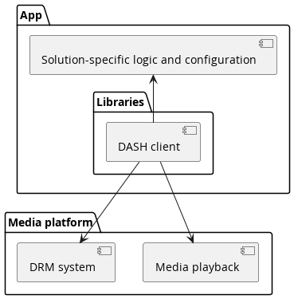
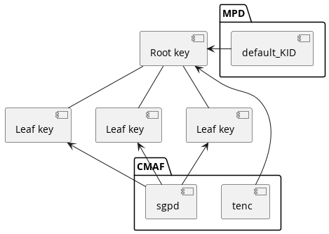

# Core concepts of content protection and security # {#security}

DASH-IF provides guidelines for using multiple [=DRM systems=] to access a DASH presentation by adding encryption signaling and [=DRM system configuration=] to DASH content encrypted in conformance to Common Encryption [[!CENC]]. In addition to content authoring guidelines, DASH-IF specifies interoperable workflows for DASH client interactions with [=DRM systems=], platform APIs and external services involved in content protection interactions.

<figure>
	
	<figcaption>A [=DRM system=] cooperates with the device's [=media platform=] to enable playback of encrypted content while protecting the decrypted samples and [=content keys=] against potential attacks. The DASH-IF implementation guidelines focus on the signaling in the DASH presentation and the interactions of the DASH client with other components.</figcaption>
</figure>

This document does not define any [=DRM system=]. DASH-IF maintains a registry of [=DRM system=] identifiers on [dashif.org](https://dashif.org/identifiers/content_protection/).

Common Encryption [[!CENC]] specifies several [=protection schemes=] which can be applied by a scrambling system and used by different [=DRM systems=]. The same encrypted DASH presentation can be decrypted by different [=DRM systems=] if a DASH client is provided the [=DRM system configuration=] for each [=DRM system=], either in the MPD or at runtime.

A <dfn>content key</dfn> is a 128-bit key used by a [=DRM system=] to make content available for playback. It is identified by a string called `default_KID` (or sometimes simply KID or "key ID"). The format constraints of the string are defined in [[!CENC]].

<div class="example">
Example `default_KID`: `72c3ed2c-7a5f-4aad-902f-cbef1efe89a9`
</div>

Advisement: While the `default_KID` format visually resembles a UUID, it is not exactly the same. UUIDs have constraints on the byte values permitted at certain positions in the data structure, whereas [[!CENC]] sets no constraints on the values in `default_KID`. [[!CENC]] defines only the format of the string and merely recommends that the value in the string conform to UUID.

A [=content key=] and its identifier are shared between all [=DRM systems=], whereas the mechanisms used for key acquisition and content protection are largely [=DRM system=] specific. Different DASH adaptation sets are often protected by different [=content keys=].

A <dfn>license</dfn> is a data structure in a [=DRM system=] specific format that contains one or more [=content keys=] and associates them with a policy that governs the usage of the [=content keys=] (e.g. expiration time). The encapsulated [=content keys=] are typically encrypted and only readable by the [=DRM system=].

# Client reference architecture for encrypted content playback # {#drm-client-components}

Different software architectural components are involved in playback of encrypted content. The exact nature depends on the specific implementation. A high-level reference architecture is described here.

<figure>
	
	<figcaption>Reference architecture for encrypted content playback.</figcaption>
</figure>

The <dfn>media platform</dfn> provides one or more APIs that allow the device's media playback and DRM capabilities to be used by a DASH client. The DASH client is typically a library included in an app. On some device types, the DASH client **_may_** be a part of the [=media platform=].

This document assumes that the [=media platform=] exposes its encrypted content playback features via an API similar to W3C Encrypted Media Extensions (EME) [[!encrypted-media]]. The technical nature of the API **_may_** be different but EME-equivalent functionality is expected.

The [=media platform=] often implements at least one [=DRM system=]. Additional [=DRM system=] implementations can be included as libraries in the app.

A <dfn>DRM system</dfn> is an implementation of [=content keys=] management. It is made of two main components: A license server for generating licenses and a DRM client for processing licenses and enforcing the associated policies. On some paltforms, the DRM client **_may_** handle the decryption of samples while on other platforms, decryption is handled by e.g. hardware elements the DRM client interacts with.

The guidelines in this document define recommended workflows and default behavior for a generic DASH client implementation that performs playback of encrypted content. In many scenarios, the default behavior is sufficient. When deviation from the default behavior is desired, <dfn>solution-specific logic and configuration</dfn> can be provided by the app. Extension points are explicitly defined in the workflows at points where solution-specific decisions are most appropriate.

# Content encryption and DRM # {#CPS-encryption-and-drm}

A DASH presentation **_may_** provide some or all adaptation sets in encrypted form, requiring the use of a [=DRM system=] to decrypt the content for playback. The duty of a [=DRM system=] is to prevent disclosure of the [=content key=] and misuse of the decrypted content (e.g. recording via screen capture software) and **_may_** be to decrypt content.

In a DASH presentation, every representation in an adaptation set **_shall_** be protected using the same [=content key=] (identified by the same `default_KID`).

This means that if representations use different [=content keys=], they **_must_** be in different adaptation sets, even if they would otherwise (were they not encrypted) belong to the same adaptation set. A `urn:mpeg:dash:adaptation-set-switching:2016` supplemental property descriptor ([[!DASH]] 5.3.3.5) **_shall_** be used to signal that such adaptation sets are suitable for switching.

Encrypted DASH content **_shall_** use either the `cenc` or the `cbcs` <dfn>protection scheme</dfn> defined in [[!CENC]]. `cenc` and `cbcs` are two mutually exclusive [=protection schemes=]. DASH content encrypted according to the `cenc` [=protection scheme=] cannot be decrypted by a [=DRM system=] supporting only the `cbcs` [=protection scheme=] and vice versa.

Some [=DRM system=] implementations support both [=protection schemes=]. Even when this is the case, clients **_shall not_** concurrently consume encrypted content that uses different [=protection schemes=].

Representations in the same adaptation set **_shall_** use the same [=protection scheme=]. Representations in different adaptation sets **_may_** use different [=protection schemes=]. If both [=protection schemes=] are used in the same period, all encrypted representations in that period **_shall_** be provided using both [=protection schemes=]. That is, the only permissible scenario for using both [=protection schemes=] together is to offer them as equal alternatives to target DASH clients with different capabilities.

Representations that contain the same media content using different [=protection schemes=] **_should_** use different [=content keys=]. This protects against some cryptographic attacks [[MSPR-EncryptionModes]].

## Robustness ## {#CPS-robustness}

[=DRM systems=] define rules that govern how they can be implemented. These rules can define different <dfn>robustness levels</dfn> which are typically used to differentiate implementations based on their resistance to attacks. The set of [=robustness levels=], their names and the constraints that apply are all specific to each [=DRM system=].

<div class="example">

A hypothetical [=DRM system=] might define the following [=robustness levels=]:

* High - All cryptographic operations are performed on a separate CPU not accessible to the device's primary operating system (often called a trusted execution environment). Decrypted data only exists in a memory region not accessible to the device's primary operating system (often called a secure media path).
* Medium - All cryptographic operations are performed on a separate CPU not accessible to the device's primary operating system. Decrypted data **_may_** be passed to the primary operating system's [=media platform=] APIs.
* Low - All operations are performed in software that can be inspected and modified by the user. Obfuscation **_must_** be used to protect against analysis.
* None - For development only. Implementation does not resist attacks.

</div>

Policy associated with content can require a [=DRM system=] implementation to conform to a certain [=robustness level=], thereby ensuring that valuable content does not get presented on potentially vulnerable implementations. This policy can be enforced on different levels, depending on the [=DRM system=]:

1. A license server **_may_** refuse to provide [=content keys=] to implementations with unacceptable [=robustness levels=].
1. The [=DRM system=] **_may_** refuse to use [=content keys=] whose [=license=] requires a higher [=robustness level=] than the implementation provides.

Multiple implementations of a [=DRM system=] **_may_** be available to a DASH client, potentially at different [=robustness levels=]. The DASH client **_must_** choose at media load time which [=DRM system=] implementation to use. However, the required [=robustness level=] **_may_** be different for different device types and is not expressed in the MPD. This decision is a matter of policy and is impossible for a DASH client to determine on its own. Therefore, [=solution-specific logic and configuration=] **_must_** inform the DASH client of the correct choice.

A DASH client **_shall_** enable [=solution-specific logic and configuration=] to specify the [=robustness level=] of the [=DRM system=] implementation to be used. Depending on which [=DRM system=] is used, this can be implemented by:

1. Changing the mapping of [=DRM system=] to [=key system=] in EME-based implementations (see [[#CPS-EME]]).
1. Specifying a minimum [=robustness level=] during capability detection (see [[#CPS-system-capabilities]]).

## W3C Encrypted Media Extensions ## {#CPS-EME}

Whereas the DRM signaling in DASH deals with [=DRM systems=], EME deals with <dfn>key systems</dfn>. While similar in concept, they are not always the same thing. A single [=DRM system=] **_may_** be implemented on a single device by multiple different [=key systems=], with different codec compatibility and functionality, potentially at different [=robustness levels=].

<div class="example">

A device **_may_** implement the "ExampleDRM" [=DRM system=] as a number of [=key systems=]:

* The key system "ExampleDRMvariant1" **_may_** support playback of encrypted H.264 and H.265 content at up to 1080p resolution with "low" [=robustness level=].
* The key system "ExampleDRMvariant2" **_may_** support playback of encrypted H.264 content at up to 4K resolution with "high" [=robustness level=].
* The key system "ExampleDRMvariant3" **_may_** support playback of encrypted H.265 content at up to 4K resolution with "high" [=robustness level=].

</div>

Even if multiple variants are available, a DASH client **_should_** map each [=DRM system=] to a single [=key system=]. The default [=key system=] **_should_** be the one the DASH client expects to offer greatest compatibility with content (potentially at a low [=robustness level=]). The DASH client **_should_** allow [=solution-specific logic and configuration=] to override the [=key system=] chosen by default (e.g. to force the use of a high-robustness variant).

# Content protection constraints for CMAF # {#CPS-cmaf}

The structure of content protection related information in the CMAF containers used by DASH is largely specified by [[!CMAF]] and [[!CENC]] (in particular section 8). This chapter outlines some additional requirements to ensure interoperable behavior of DASH clients and services.

Note: This document uses the `cenc:` prefix to reference the XML namespace `urn:mpeg:cenc:2013` [[!CENC]].

Initialization segments **_should not_** contain any `moov/pssh` box ([[!CMAF]], section 7.4.3) and DASH clients **_may_** ignore such boxes when encountered. Instead, `pssh` boxes required for [=DRM system=] initialization are part of the [=DRM system configuration=] and **_should_** be placed in the MPD as `cenc:pssh` elements in [=DRM system=] specific `ContentProtection` descriptors.

Note: Placing the `pssh` boxes in the MPD has become common for purposes of operational agility - it is often easier to update MPD files than rewrite initialization segments when the default [=DRM system configuration=] needs to be updated or when a new [=DRM system=] needs to be supported. Furthermore, in some scenarios the appropriate set of `pssh` boxes is not known when the initialization segment is created.

Protected content **_may_** be published without any `pssh` boxes in both the MPD and media segments. All [=DRM system configuration=] can be provided at runtime, including the `pssh` box data. See also [[#CPS-mpd-drm-config]].

Media segments **_may_** contain `moof/pssh` boxes ([[!CMAF]] 7.4.3) to provide updates to [=DRM system=] internal state (e.g. to supply new [=leaf keys=] in a [[#CPS-KeyHierarchy|key hierarchy]]). See [[#CPS-default_KID-hierarchy]] for an example.

Note: These state updates **_may_** be transparent to a DASH client on some [=media platforms=] that intercept the `moof/pssh` boxes and supply them directly to the active [=DRM system=]; on other [=media platforms=], the DASH client **_may_** need to extract and forward the `moof/pssh` boxes to the [=DRM system=].

## Content protection data in CMAF containers ## {#CPS-cmaf-structure}

This chapter describes the structure of content protection data in CMAF containers used to provide encrypted content in a DASH presentation, summarizing the requirements defined by [[!ISOBMFF]], [[!DASH]], [[!CENC]], [[!CMAF]] and other parts of DASH-IF implementation guidelines.

DASH initialization segments contain:

* Zero or more `moov/pssh` "Protection System Specific Header" boxes ([[!CENC]] 8.1) which provide [=DRM system=] initialization data in [=DRM system=] specific format. This usage is deprecated in favor of providing this data in the MPD. If both are present, the value in the MPD is used. See [[#CPS-mpd-drm-config]].
* Exactly one `moov/trak/mdia/minf/stbl/stsd/sinf/schm` "Scheme Type" box ([[!ISOBMFF]] 8.12.5) identifying the [=protection scheme=]. See [[!CENC]] section 4.
* Exactly one `moov/trak/mdia/minf/stbl/stsd/sinf/schi/tenc` "Track Encryption" box ([[!CENC]] 8.2) which contains default encryption parameters for samples. These default parameters **_may_** be overridden in media segments (see below).

DASH media segments are composed of a single CMAF fragment that contains:

* Exactly one `moof/traf/senc` "Sample Encryption" box ([[!CENC]] 7.2) which stores initialization vectors (IVs) and, optionally, subsample encryption ranges for samples in the same CMAF fragment.
* Zero or one `moof/traf/saiz` "Sample Auxiliary Information Size" boxes ([[!ISOBMFF]] 8.7.8) which references the sizes of the per-sample data stored in the `moof/traf/senc` box ([[!CMAF]] 8.2.2 and [[!CENC]] section 7).
    * Omitted if the parameters provided by the `senc` box are identical for all samples in the CMAF fragment.
* Zero or one `moof/traf/saio` "Sample Auxiliary Information Offset" boxes ([[!ISOBMFF]] 8.7.9) which references the sizes of the per-sample data stored in the `moof/traf/senc` box ([[!CMAF]] 8.2.2 and [[!CENC]] section 7).
    * Omitted if the parameters provided by the `senc` box are identical for all samples in the CMAF fragment.
* Zero or more `moof/pssh` "Protection System Specific Header" boxes ([[!CENC]] 8.1) which provide transparent updates to [=DRM system=] internal state. See [[#CPS-mpd-moof-pssh]].
* For each sample group, exactly one `moof/traf/sgpd` "Sample Group Description" box ([[!ISOBMFF]] 8.9.3 and [[!CENC]] section 6) which contains overrides for encryption parameters defined in the `tenc` box.
    * Omitted if no parameters are overridden.
* For each sample grouping type (see [[!ISOBMFF]], typically one), exactly one `moof/traf/sbgp` "Sample to Group" box ([[!ISOBMFF]] 8.9.2 and [[!CENC]] section 6) which associates samples with sample groups.
    * Omitted if no parameters are overridden.

[[#CPS-KeyHierarchy|A key hierarchy]] is implemented by listing the `default_KID` in the `tenc` box of the initialization segment (identifying the [=root key=]) and then overriding the key identifier in the `sgpd` boxes of media segments (identifying the [=leaf keys=] that apply to each media segment). The `moof/pssh` box is used to deliver/unlock new [=leaf keys=] and **_may_** provide the associated license policy.

When using CMAF chunks for delivery, each CMAF fragment **_may_** be split into multiple CMAF chunks. If the CMAF fragment contained any `moof/pssh` boxes, copies of these boxes **_shall_** be present in each CMAF chunk that starts with an independent media sample.

Note: While DASH only requires the presence of `moof/pssh` in the first CMAF chunk, the requirement is more extensive in the interest of HLS interoperability [[HLS-LowLatency]].

# Encryption and DRM signaling in the MPD # {#CPS-mpd}

A DASH client needs to recognize encrypted content and activate a suitable [=DRM system=], configuring it to decrypt content. The MPD informs a DASH client of the [=protection scheme=] used to protect content, identifies the [=content keys=] that are used and optionally provides the default [=DRM system configuration=] for a set of [=DRM systems=].

The <dfn>DRM system configuration</dfn> is the complete data set required for a DASH client to activate a single [=DRM system=] and configure it to decrypt content using a single [=content key=]. <b>It is supplied by a combination of XML elements in the MPD and/or [=solution-specific logic and configuration=]</b>. The [=DRM system configuration=] often contains:

* DRM system initialization data in the form of a DRM system specific `pssh` box (as defined in [[!CENC]]).
* DRM system initialization data in some other DRM system specific form (e.g. `keyids` JSON structure used by [[#CPS-AdditionalConstraints-W3C|W3C Clear Key]])
* The used [=protection scheme=] (`cenc` or `cbcs`)
* `default_KID` that identifies the [=content key=]
* License server URL
* [[#CPS-lr-model|Authorization service URL]]

The exact set of values required for successful DRM workflow execution depends on the requirements of the selected [=DRM system=] (e.g. what kind of initialization data it can accept) and the mechanism used for [=content key=] acquisition (e.g. [[#CPS-lr-model|the DASH-IF interoperable license request model]]). By default, a DASH client **_should_** assume that a [=DRM system=] accepts initialization data in `pssh` format and that [[#CPS-lr-model|the DASH-IF interoperable license request model]] is used for [=content key=] acquisition.

When configuring a [=DRM system=] to decrypt content using multiple [=content keys=], a distinct [=DRM system configuration=] is associated with each [=content key=]. Concurrent use of multiple [=DRM systems=] is not an interoperable scenario.

Note: In theory, it is possible for the [=DRM system=] initialization data to be the same for different [=content keys=]. In practice, the `default_KID` is often included in the initialization data so this is unlikely. Nevertheless, DASH clients cannot assume that using equal initialization data implies anything about equality of the [=DRM system configuration=] or the [=content key=] - the `default_KID` is the factor identifying the scope in which a single [=content key=] is to be used. See [[#CPS-default_KID]].

The [=DRM system configuration=] **_may_** change over time, both due to MPD updates in live services and due to runtime changes in the [=solution-specific logic and configuration=]. A typical example of runtime changse would be using a unique license server URL for each license request.

## Signaling presence of encrypted content ## {#CPS-mpd-scheme}

The presence of a `ContentProtection` descriptor with `schemeIdUri="urn:mpeg:dash:mp4protection:2011"` on an adaptation set informs a DASH client that all representations in the adaptation set are encrypted in conformance to Common Encryption ([[!DASH]] sections 5.8.4.1 and 5.8.5.2 and [[!CENC]] section 11) and require a [=DRM system=] to provide access.

This descriptor is present for all encrypted content ([[!DASH]] section 5.8.4.1). It **_shall_** be defined on the adaptation set level. The `value` attribute indicates the used protection scheme ([[!DASH]] section 5.8.5.2). The `cenc:default_KID` attribute **_shall_** be present and have a value matching the `default_KID` in the `tenc` box.

<div class="example">
Signaling an adaptation set encrypted using the `cbcs` scheme and with a [=content key=] identified by `34e5db32-8625-47cd-ba06-68fca0655a72`.

<xmp highlight="xml">
<ContentProtection
    schemeIdUri="urn:mpeg:dash:mp4protection:2011"
    value="cbcs"
    cenc:default_KID="34e5db32-8625-47cd-ba06-68fca0655a72" />
</xmp>
</div>

The `tenc` box stores `default_KID` as a 16-byte array. The byte order **_shall_** be identical in the binary structure and the string-form `default_KID`.

<div class="example">
The following are two equivalent forms of representing the same `default_KID`:

* In string form: `00010203-0405-0607-0809-0a0b0c0d0e0f`
* In binary form: `0x00`, `0x01`, `0x02`, `0x03`, `0x04`, `0x05`, `0x06`, `0x07`, `0x08`, `0x09`, `0x0a`, `0x0b`, `0x0c`, `0x0d`, `0x0e`, `0x0f`

</div>

Advisement: Some Windows-targeting software libraries implement "Microsoft style" UUID serialization that changes the order of bytes when transforming between string form and binary form. This is not appropriate when serializing/deserializing `default_KID` values. Linux-based tooling typically does not change the byte order.

## default_KID defines the scope of DRM system interactions ## {#CPS-default_KID}

A DASH client interacts with one or more [=DRM systems=] during playback in order to control the decryption of content. Some of the most important interactions are:

* Activating a [=DRM system=] to play back content protected with a specific set of [=content keys=].
* Communicating with the [=DRM system=] to make [=content keys=] available for use, executing license requests as needed.

The scope of each of these interactions is defined by the `default_KID`. Each distinct `default_KID` identifies exactly one [=content key=]. The impact of this is further outlined in [[#CPS-client-workflows]].

When activating a [=DRM system=], a DASH client **_shall_** determine the required set of [=content keys=] based on the `default_KID` values of adaptation sets selected for playback. This set of [=content keys=] is used to activate the [=DRM system=], after which zero or more of the [=content keys=] from this set are available for playback.

Clients **_shall_** provide all `default_KIDs` of the selected adaptation sets to the [=DRM system=] during activation and **_shall not_** assume that activating a [=DRM system=] with one [=content key=] will implicitly enable the use of any other [=content key=].

Note: An occasionally encountered anti-pattern is to activate a [=DRM system=] for only key X but to configure the license server to always provide both keys X and Y when key X is requested. This is not inteoperable behavior.

The DASH client and/or [=DRM system=] **_may_** batch license requests for different `default_KIDs` (and the respective responses) into a single transaction (for example, to reduce the chattiness of license acquisition traffic).

Note: This optimization might require support from platform APIs and/or [=DRM system=] specific logic from the DASH client, as a batching mechanism is not yet a standard part of DRM related platform APIs.

### default_KID in hierarchical/derived/variant key scenarios ### {#CPS-default_KID-hierarchy}

While it is common that `default_KID` identifies the actual [=content key=] used for encryption, a [=DRM system=] **_may_** make use of other keys in addition to the one signalled by the `default_KID` value but this **_shall_** be transparent to the client with only the `default_KID` being used in interactions between the DASH client and the [=DRM system=]. See [[#CPS-KeyHierarchy]].

<figure>
	
	<figcaption>In a [[#CPS-KeyHierarchy|hierarchical key scenario]], `default_KID` references the [=root key=] and only the sample group descriptions reference the [=leaf keys=].</figcaption>
</figure>

In a [[#CPS-KeyHierarchy|hierarchical key scenario]], `default_KID` identifies the [=root key=], not the [=leaf key=] used to encrypt media samples, and the handling of [=leaf keys=] is not exposed to a DASH client. As far as a DASH client knows, there is always only one [=content key=] identified by `default_KID`.

This logic applies to all scenarios that make use of additional keys, regardless of whether they are based on the key hierarchy, key derivation or variant key ([[iso23001-12]]) concepts.

## Providing default DRM system configuration ## {#CPS-mpd-drm-config}

A DASH service **_should_** supply a default [=DRM system configuration=] in the MPD for all supported [=DRM systems=] in all encrypted adaptation sets. This enables playback without the need for DASH client customization or additional client-side configuration. [=DRM system configuration=] **_may_** also be supplied by [=solution-specific logic and configuration=], replacing or enhancing the defaults provided in the MPD.

Any number of `ContentProtection` descriptors ([[!DASH]] section 5.8.4.1) **_may_** be present in the MPD to provide [=DRM system configuration=]. These descriptors **_shall_** be defined on the adaptation set level. The contents **_may_** be ignored by the DASH client if overridden by [=solution-specific logic and configuration=] - the [=DRM system configuration=] in the MPD simply provides default values known at content authoring time.

A `ContentProtection` descriptor providing a default [=DRM system configuration=] **_shall_** use  `schemeIdUri="urn:uuid:<systemid>"` to identify the [=DRM system=], with the `<systemid>` matching a value in the [DASH-IF system-specific identifier registry](https://dashif.org/identifiers/content_protection/). The `value` attribute of the `ContentProtection` descriptor **_should_** contain the DRM system name and version number in a human readable form (for diagnostic purposes).

Note: W3C defines the Clear Key mechanism ([[!encrypted-media]] section 9.1), which is a "dummy" DRM system implementation intended for client and platform development/testing purposes. **Understand that Clear Key does not fulfill the content protection and content key protection duties ordinarily expected from a DRM system.** For more guidelines on Clear Key usage, see [[#CPS-AdditionalConstraints-W3C]].

Each DRM system specific `ContentProtection` descriptor can contain a mix of XML elements and attributes defined by [[!CENC]], the [=DRM system=] author, DASH-IF or any other party.

For [=DRM systems=] initialized by supplying `pssh` boxes, the `cenc:pssh` element **_should_** be present under the `ContentProtection` descriptor if the value is known at MPD authoring time. The base64 encoded contents of the element **_shall_** be equivalent to a complete `pssh` box including its length and header fields ([[!CENC]] section 11.3.3). See also [[#CPS-cmaf]].

[=DRM systems=] generally use the concept of license requests as the mechanism for obtaining [=content keys=] and associated usage constraints (see [[#CPS-license-request-workflow]]). For [=DRM systems=] that use this concept, one or more `dashif:laurl` elements **_should_** be present under the `ContentProtection` descriptor, with the value of the element being the URL to send license requests to. This URL **_may_** contain [[#CPS-lr-model-contentid|content identifiers]].

Multiple mechanisms have historically been used to provide the license server URL in the MPD (e.g. embedding in the `cenc:pssh` data or passing by deprecated DRM system specific DASH-IF `Laurl` elements). A DASH client **_shall_** prefer `dashif:laurl` if multiple data sources for the URL are present in the MPD.

For [=DRM systems=] that require proof of authorization to be attached to the license request in a manner conforming to [[#CPS-lr-model]], one or more `dashif:authzurl` elements **_should_** be present under the `ContentProtection` descriptor, containing the default URL to send authorization requests to (see [[#CPS-license-request-workflow]]).

Multiple `dashif:laurl` or `dashif:authzurl` elements under the same `ContentProtection` descriptor define sets of equivalent alternatives for the DASH client to choose from. A DASH client **_should_** select a random item from the set every time the value of such an element is used.

Issue: The above paragraph on URL handling **_should_** be generalized to all sets of alternative URLs but there does not seem to be a suitable chapter in v4.3 If such a chapter is created in v5, we could replace the above paragraph with a reference to the general URL handling guidelines.

<div class="example">
A `ContentProtection` descriptor that provides default [=DRM system configuration=] for a fictional [=DRM system=].

<xmp highlight="xml">
<ContentProtection
  schemeIdUri="urn:uuid:d0ee2730-09b5-459f-8452-200e52b37567"
  value="FirstDRM 2.0">
  <cenc:pssh>YmFzZTY0IGVuY29kZWQgY29udGVudHMgb2YgkXBzc2iSIGJveCB3aXRoIHRoaXMgU3lzdGVtSUQ=</cenc:pssh>
  <dashif:authzurl>https://example.com/tenants/5341/authorize</dashif:authzurl>
  <dashif:laurl>https://example.com/AcquireLicense</dashif:laurl>
</ContentProtection>
</xmp>
</div>

The presence of a [=DRM system=] specific `ContentProtection` descriptor is not required in order to activate the [=DRM system=]; these descriptors are used merely to provide the default [=DRM system configuration=]. Empty `ContentProtection` descriptors **_should not_** be present in an MPD and **_may_** be ignored by DASH clients.

### Signaling HDCP output control information ### {#CPS-mpd-hdcp-output-control}

Issue: This section is a first reconciliation backfill for published IOP v5.1.0
Part 6 clause 7.4, "Signaling HDCP output control information". The current
Bikeshed source did not previously contain an explicit HDCP/output-control
section. The normative details and XML examples still need to be checked against
the published source text before this clause is marked fully reconciled in
`rag/reports/reconcile-part06-content-protection.md`.

The `ContentProtection` descriptor provides the description of the [=DRM systems=]
that allow access to encrypted content. DASH also defines an `OutputProtection`
descriptor that carries information allowing a DASH client to determine what
version of an output-protection scheme is required when exporting content
protected by that output-protection scheme.

The `OutputProtection` descriptor applies to the representations with which it is
associated, irrespective of the [=DRM systems=] that allow access to those
representations. As specified by [[!DASH]], the information provided by
`OutputProtection` is informative: every [=DRM system=] has its own list of
supported output-protection schemes and compliance rules, and a [=license=]
**_may_** override the information signaled in the MPD.

For HDCP output control, DASH defines an `OutputProtection` descriptor with
`schemeIdUri="urn:mpeg:dash:output-protection:hdcp:2020"`. The `value` attribute
identifies the minimum HDCP version that a device is expected to enforce for the
representations associated with the descriptor.

If present, the HDCP `OutputProtection` descriptor **_shall_** be defined at the
`AdaptationSet` level. If a DASH client selects several adaptation sets for
playback that each contain an HDCP `OutputProtection` descriptor, it **_shall_**
enforce the highest HDCP version among those descriptors.

Note: It is likely that the highest HDCP version is requested for the adaptation
set containing the representations with the highest resolution.

<div class="example">

The following MPD snippet shows two adaptation sets with different required HDCP
versions. A device consuming only adaptation set `1` enforces HDCP 1.4 at
minimum, while a device consuming both adaptation sets enforces HDCP 2.3 at
minimum.

```xml
<AdaptationSet segmentAlignment="true" id="1" group="1" maxWidth="1920" maxHeight="1080">
  <SupplementalProperty schemeIdUri="urn:mpeg:dash:adaptation-set-switching:2016" value="2" />
  <ContentProtection schemeIdUri="urn:mpeg:dash:mp4protection:2011"
                     value="cenc"
                     cenc:default_KID="c14f0709-f2b9-4427-916b-61b52586506a" />
  <OutputProtection value="1.4" schemeIdUri="urn:mpeg:dash:output-protection:hdcp:2020" />
</AdaptationSet>
<AdaptationSet segmentAlignment="true" id="2" group="1" maxWidth="3840" maxHeight="2160">
  <SupplementalProperty schemeIdUri="urn:mpeg:dash:adaptation-set-switching:2016" value="1" />
  <ContentProtection schemeIdUri="urn:mpeg:dash:mp4protection:2011"
                     value="cenc"
                     cenc:default_KID="8b029e51-d56a-44bd-910f-d4b5fd90fba2" />
  <OutputProtection value="2.3" schemeIdUri="urn:mpeg:dash:output-protection:hdcp:2020" />
</AdaptationSet>
```

</div>

Because `default_KID` determines the scope of [=DRM system=] interactions, the contents of [=DRM system=] specific `ContentProtection` descriptors with the same `schemeIdUri` **_shall_** be identical in all adaptation sets with the same `default_KID`. This means that a [=DRM system=] will treat equally all adaptation sets that use the same [=content key=].

Note: If you wish to change the default [=DRM system configuration=] associated with a [=content key=], you **_must_** update all the instances where the data is present in the MPD. For live services, this can mean updating the data in multiple periods.

To maintain the `default_KID` association, a DASH client that exposes APIs/callbacks to business logic for the purpose of controlling DRM interactions and/or supplying data for [=DRM system configuration=] **_shall not_** allow these APIs to associate multiple [=DRM system configurations=] for the same [=DRM system=] with the same `default_KID`. Conversely, DASH client APIs **_should_** allow business logic to provide different [=DRM system configurations=] for the same [=DRM system=] for use with different `default_KIDs`.

## Delivering updates to DRM system internal state ## {#CPS-mpd-moof-pssh}

Some DRM systems support live updates to DRM system internal state (e.g. to deliver new [=leaf keys=] in a key hierarchy). These updates **_shall not_** be present in the MPD and **_shall_** be delivered by `moof/pssh` boxes in media segments.
